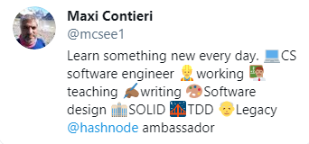

# 10 Tricks to Build an Awesome Personal Portfolio and Get Your Dream Job

I've recently discovered personal branding and the importance of a shinny and updated portfolio.

Working as a software engineer for 25 years never spend enough time on personal branding.

To fix this error I read a lot on the subject during lockdown. 

These are the advices that worked for me:

# 1. Build your presence and keep it updated 🆕

Build a [LinkedIn profile](https://www.linkedin.com/in/mcsee/), a [GitHub one](https://blog.learncodeonline.in/creating-a-smart-way-github-profile-readmemd) and engage in interesting technical conversations on Twitter or Discuss.

[The Tech Twitter Guide to the Galaxy](Twitter\The Tech Twitter Guide to the Galaxy)

Whenever you publish something, create a new open source project or finish a course, post it and add it to your profile.

I take a lot of interviews and I google every candidate trying to find out if she/he keeps updated and learns all the time.

https://lo-victoria.com/why-a-personal-brand-is-important-for-a-developer

Garden your profile.

[Today I Learned the Concept of Gardening](Blogging\Today I Learned the Concept of Gardening)

# 2. Use the same picture everywhere 😲

If you happen to have a common name, this will allow interviews to research your work and distinguish from other people.

People must recognize your face. 

You can use [Gravatar](https://gravatar.com/) or another synchronization service or keep it manually

# 3. Keep your Bio Short and concise ▫️

You have limited room.

Try using [emojis](emojipedia) instead of words

Be short and concise on your bio.

Say what you are good at, and *more important* what [you aren't](https://maximilianocontieri/about).

# 4. Buy [your Name](https://maximilianocontieri.com)'s Domain and Keep it updated 🌐

You can use hashnode's custom domain, so you don't need to know anything about website programming, hosting etc.

https://catalinstech.medium.com/why-hashnode-is-different-than-other-blogging-platforms-and-the-best-for-developers-83c23f6b323d

# 5. Take Good Care of SEO 🔎

Google your articles, find relevant keywords, use [Search Console](https://search.google.com/search-console) (old webmaster tools), [Serpsim](https://serpsim.com/) etc.

If you republish your articles, make sure you use canonical urls to avoid harming your SEO.

https://blog.kieranroberts.dev/how-i-improved-my-portfolio-seo-including-tips-and-resources

# 6. Build your Network 🕸️

Recommend people and be recommended on LinkedIn.
Add your [assessments](https://www.linkedin.com/help/linkedin/answer/94427) and validate them with the online exams.

https://blog.nickbulljs.com/linkedin-profile-every-recruiter-want-you-to-have-cklm66h7r04rpsbs1es0zdw6z

# 7. Be Ready for You Interviews 🕴️

Take your time to research your interviewer. 

Find what the company does and where will you fit.

Sometimes attitude is more important than background.

Be ready to say 'I don't know'. 

Never lie. We know when candidates lie.

# 8. Showcase your Projects 🏗️

Companies don't care much on where you worked or the technologies you master. 

They care a lot about *the change* you can bring to their products.

Carry some measurable success stories were *YOU* made a big impact.

If you are just starting you can showcase personal projects where *YOU* think you can make a big impact. 

Don't bring toy projects. We have seen them all.

# 9. Follow the right tags 🏁

Content is dynamic. 

Make sure you follow these tags:

- [Branding](https://hashnode.com/n/branding)

- [Portfolio](https://hashnode.com/n/portfolio)

- [SEO](https://hashnode.com/n/seo)

Besides following your own tech preferences.

https://lauragift21.hashnode.dev/building-a-killer-personal-brand

# 10. Follow the Right People for More Advices 💃🕺

These people know a lot about personal branding and publish amazing content.

@[Victoria Lo](@victoria), @[Nick Bull](@nickbulljs), @[Gift Egwuenu](@lauragift21) and many others

%%[buymeacoffee]