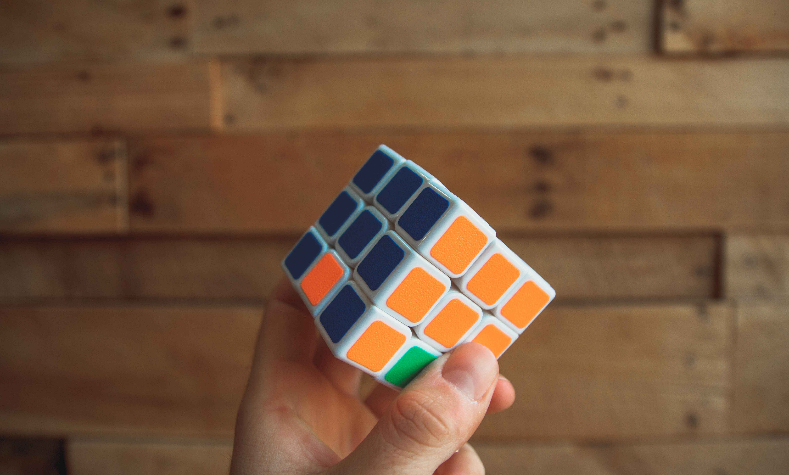

# Code Smell 06 - Too Clever Programmer



*Code is difficult to read and tricky with names without semantics. Sometimes using language's accidental complexity.*

> TL;DR: Don't pretend you are too smart. Clean code asks for readability and simplicity.

# Problems

- Readability

- Maintainability

- Code Quality

- Premature Optimization

# Solutions

- Refactor the code

- Use [better names](Theory\What exactly is a name — Part I The Quest)

# Examples

- Optimized loops

# Exceptions

- Optimized code for low-level operations.

# Sample Code

## Wrong

[Gist Url]: # (https://gist.github.com/mcsee/df27505a28b5f65faaa273b0bfe1f322)
```javascript
function primeFactors(n) {
  var f = [],  i = 0, d = 2;  
  
  for (i = 0; n >= 2; ) {
     if(n % d == 0) {
       f[i++]=(d); 
       n /= d;
    }
    else{
      d++;
    }     
  }
  return f;
}
```

## Right

[Gist Url]: # (https://gist.github.com/mcsee/4749cfe51de1c02848df1aa802fa5705)
```javascript
function primeFactors(numberToFactor) {
  var factors = [], 
      divisor = 2,
      remainder = numberToFactor;
  
  while(remainder>=2) {
    if(remainder % divisor === 0) {
       factors.push(divisor); 
       remainder = remainder/ divisor;
    }
    else{
      divisor++;
    }     
  }
  return factors;
}
```

# Detection

Automatic detection is possible in some languages.
Watch some warnings related to complexity, bad names, post-increment variables, etc.

# Relations

[Code Smell 02 - Constants and Magic Numbers](Code Smells\Code Smell  02 - Constants and Magic Numbers)

[Code Smell 20 - Premature Optimization](Code Smells\Code Smell 20 - Premature Optimization)

# Also Known as

- Obfuscator

# Conclusion

Too clever developers write cryptic code to brag. Smart developers write clean code. 
Clear beats clever.

# Tags

- Declarative

# More Info

https://ardalis.com/are-boolean-flags-on-methods-a-code-smell/

# Refactorings

[Refactoring 005 - Replace Comment with Function Name](Refactorings\Refactoring 005 - Replace Comment with Function Name)

# Credits

Photo by [NeONBRAND](https://unsplash.com/@neonbrand) on [Unsplash](https://unsplash.com/s/photos/smart-brain)

* * *

> Programming can be fun, so can cryptography; however they should not be combined.

_Kreitzberg & Shneiderman_

[Software Engineering Great Quotes](Quotes\Software Engineering Great Quotes)

* * *

This article is part of the CodeSmell Series.

[How to Find the Stinky parts of your Code]()