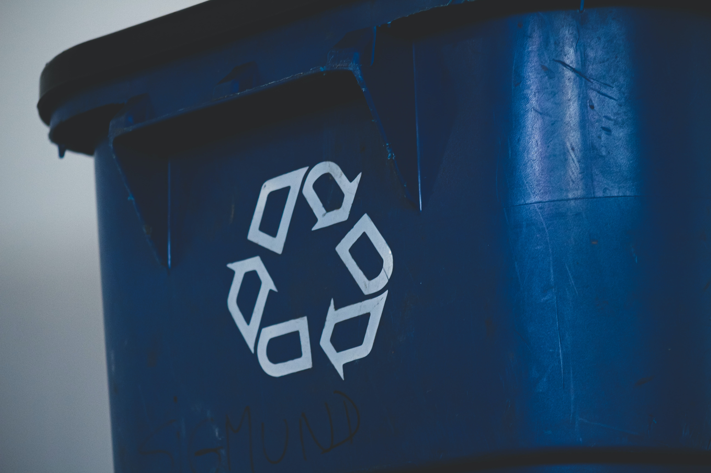

# Code Smell 107 - Variables Reuse



*Reusing variables makes scopes and boundaries harder to follow*

> TL;DR: Don't read and write the same variable for different purposes

# Problems

- Readability

- Hidden problems

# Solutions

1. Don't reuse variables

2. [Extract Method](Refactorings\Refactoring 002 - Extract Method) to isolate scopes

# Context

When programming a script it is common to reuse variables.

This leads to confusion and makes debugging harder.

We should narrow the scope as much as possible.

# Sample Code

## Wrong

[Gist Url]: # (https://gist.github.com/mcsee/88615884493c78d45a57be565964ae5b)
```java
// print line total
double total = item.getPrice() * item.getQuantity();
System.out.println("Line total: " + total );

// print amount total 
total = order.getTotal() - order.getDiscount();
System.out.println( "Amount due: " + total );

// variable is reused
```

## Right

[Gist Url]: # (https://gist.github.com/mcsee/9657946be3bcd5a81aebc12d4ef82d0b)
```java
function printLineTotal() {
  double total = item.getPrice() * item.getQuantity();
  System.out.println("Line total: " + total );
}

function printAmountTotal() {
  double total = order.getTotal() - order.getDiscount();
  System.out.println( "Amount due: " + total );
}
```

# Detection

[X] Automatic 

Linters can use the parse tree to find variable definition and usages.

# Tags

- Readability

# Conclusion

Avoid reusing variable names. Use more specific and different names.

# Relations

[Code Smell 03 - Functions Are Too Long](Code Smells\Code Smell 03 - Functions Are Too Long)

# More Info

[Refactoring 002 - Extract Method](Refactorings\Refactoring 002 - Extract Method)

# Credits

Photo by [Sigmund](https://unsplash.com/@sigmund) on [Unsplash](https://unsplash.com/s/photos/recycle)
  
* * *

> Simplicity before generality, use before reuse.

_Kevlin Henney_
 
[Software Engineering Great Quotes](Quotes\Software Engineering Great Quotes)

* * *

This article is part of the CodeSmell Series.

[How to Find the Stinky parts of your Code]()