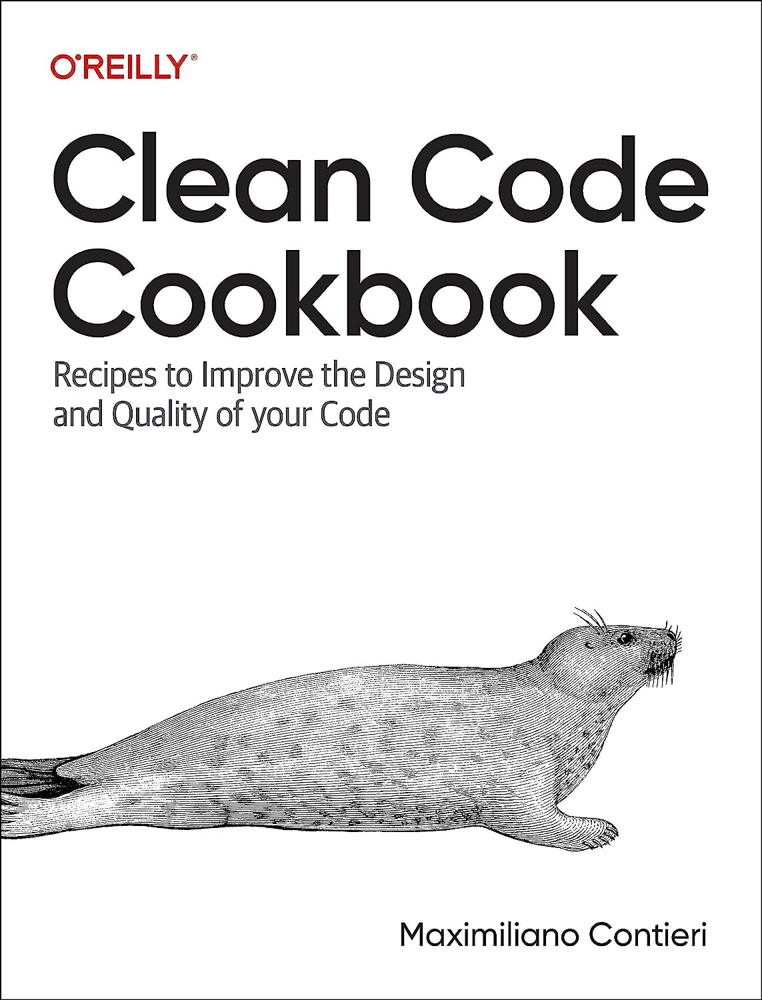

# Code Smell 218 - Magic Concatenation
            


*If you miss a comma, you are concatenating*

> TL;DR: Watch out for fancy language assumptions

# Problems

- Possible defects

- The [least surprise principle](https://en.wikipedia.org/wiki/Principle_of_least_astonishment) violation

- Hidden Assumptions

# Solutions

1. Be declarative

2. Use good linters

3. Prefer declarative languages

# Context

Many programming languages favor laziness over readability and clean code.

You should use them with caution and trust your tests.

# Sample Code

## Wrong

<!-- [Gist Url](https://gist.github.com/mcsee/0f9cad84530ebad6592fa17cb016f2c8) -->

```python
tools = [
    "Amazon Codewhisperer",
    "Bard" # Notice the missing comma
    "ChatGPT",
    "Dalle-E" # Also here
    "Eliza"
    ]
    
print(len(tools))
# This will output 3 

print(tools)
# ['Amazon Codewhisperer', 'BardChatGPT', 'Dalle-EEliza']
# Missing Commas act as hidden string concatenators
```

## Right

<!-- [Gist Url](https://gist.github.com/mcsee/4dfc8f7fb9189f1aa2f2986e924f41d1) -->

```python
tools = [
    "Amazon Codewhisperer",
    "Bard",
    "ChatGPT",
    "Dalle-E",
    "Eliza"
]

# We added all the missing commas

print(len(tools))
# 5

print(tools)
# ['Amazon Codewhisperer', 'Bard', 'ChatGPT', 'Dalle-E', 'Eliza']
```

# Detection

[X] Semi-Automatic 

Many linters warn about this problem. 

Also, [ChatGPT](https://chat.openai.com/) and [Bard](https://bard.google.com/) can detect the problem.

# Tags

- Readability

# Conclusion

Many modern programming languages come with a significant amount of accidental complexity. 

They are often optimized for writing code quickly, even though they may be prone to defects.

Unfortunately, when working with these languages, it is essential to exercise extreme caution.

# Relations

[Code Smell 84 - Max < Min (Javascript)](https://github.com/mcsee/Software-Design-Articles/tree/main/Articles/Code%20Smells/Code%20Smell%2084%20-%20Max%20%20Min%20(Javascript)/readme.md)

[Code Smell 69 - Big Bang (JavaScript Ridiculous Castings)](https://github.com/mcsee/Software-Design-Articles/tree/main/Articles/Code%20Smells/Code%20Smell%2069%20-%20Big%20Bang%20(JavaScript%20Ridiculous%20Castings)/readme.md)

[Code Smell 06 - Too Clever Programmer](https://github.com/mcsee/Software-Design-Articles/tree/main/Articles/Code%20Smells/Code%20Smell%2006%20-%20Too%20Clever%20Programmer/readme.md)

# Disclaimer

Code Smells are my [opinion](https://github.com/mcsee/Software-Design-Articles/tree/main/Articles/Blogging/I%20Wrote%20More%20than%2090%20Articles%20on%202021%20Here%20is%20What%20I%20Learned/readme.md).

# Credits

Photo by [Edge2Edge Media](https://unsplash.com/@edge2edgemedia) on [Unsplash](https://unsplash.com/photos/t1OalCBUYRc)
    
* * *

> A programming language is low level when its programs require attention to the irrelevant.

_Alan J. Perlis_
 
[Software Engineering Great Quotes](https://github.com/mcsee/Software-Design-Articles/tree/main/Articles/Quotes/Software%20Engineering%20Great%20Quotes/readme.md)

* * *

This article is part of the CodeSmell Series.

[How to Find the Stinky Parts of your Code](https://github.com/mcsee/Software-Design-Articles/tree/main/Articles/Code%20Smells/How%20to%20Find%20the%20Stinky%20parts%20of%20your%20Code/readme.md)

* * *

My new book about clean code is available for pre-order.

You will find several recipes like this one with a higher level of detail

[](https://amzn.to/44s1XdO)