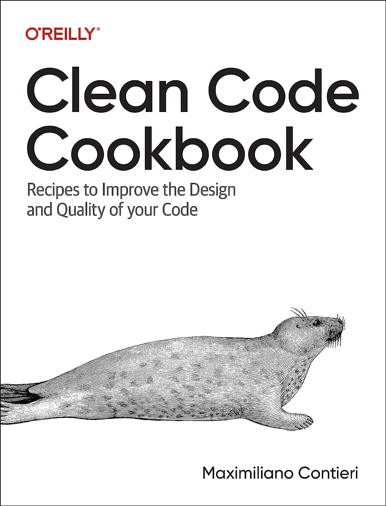

# Code Smell 219 - Looping from index 0
            


*Counting from zero seems natural. Doesn't it?*

> TL;DR: Start counting from one instead of zero. Like humans do.

# Problems

- [Bijection](https://github.com/mcsee/Software-Design-Articles/tree/main/Articles/Theory/The%20One%20and%20Only%20Software%20Design%20Principle/readme.md) from real-world broken

- Cognitive load

- Overly implementation-oriented code

# Solutions

1. Favor high-level declarative languages

# Context

Low-level languages force you to think at a machine level.

Hardware turning machines were designed to use binary gates and start indexing at 0.

A few programming languages use one-based indexing, where indexing starts from 1. 

These languages are known for being higher level and more declarative:

- Basic / Visual Basic
- Pascal
- Smalltalk
- Fortran
- Lua
- MATLAB
- R
- Julia 

# Sample Code

## Wrong

[Gist Url]: # (https://gist.github.com/mcsee/79140cca1b6b1d1459ae73801ef26845)
```go
package main

import "fmt"

func main() {    
    numbers := []int{10, 20, 30, 40, 50}
    
    for i := 0; i < len(numbers); i++ {
        // Iteration goes from zero to len-1
        fmt.Println(numbers[i])
    }
}
```

## Right

[Gist Url]: # (https://gist.github.com/mcsee/3ccf0ebb605c95b96a185999290bd52f)
```matlab
numbers = [10, 20, 30, 40, 50];

% Looping through the array using one-based indexing
% from 1 to length
for currentIndex = 1:length(numbers)
    disp(numbers(currentIndex));
end
```

# Detection

[X] Automatic 

This is a language smell. 

# Exceptions

- Low-level optimized code

# Tags

- Declarative Code

# Conclusion

We need to think as humans when we code and not as machines.

Humans count from one.

[Zero number](https://en.wikipedia.org/wiki/0) was a brilliant discovery in math and science but it does not apply to everyday counting.

# Relations

[Code Smell 53 - Explicit Iteration](https://github.com/mcsee/Software-Design-Articles/tree/main/Articles/Code%20Smells/Code%20Smell%2053%20-%20Explicit%20Iteration/readme.md)

[Code Smell 123 - Mixed 'What' and 'How'](https://github.com/mcsee/Software-Design-Articles/tree/main/Articles/Code%20Smells/Code%20Smell%20123%20-%20Mixed%20'What'%20and%20'How'/readme.md)

# More Info

[Wikipedia](https://en.wikipedia.org/wiki/Zero-based_numbering)

[Dijkstra on Numbering](https://www.cs.utexas.edu/users/EWD/transcriptions/EWD08xx/EWD831.html)

# Disclaimer

Code Smells are my [opinion](https://github.com/mcsee/Software-Design-Articles/tree/main/Articles/Blogging/I%20Wrote%20More%20than%2090%20Articles%20on%202021%20Here%20is%20What%20I%20Learned/readme.md).

# Credits

Photo by [Andy Kelly](https://unsplash.com/@askkell) on [Unsplash](https://unsplash.com/photos/0E_vhMVqL9g)  
  
* * *

> Pay attention to zeros. If there is a zero, someone will divide by it.

_Cem Kaner_ 
 
[Software Engineering Great Quotes](https://github.com/mcsee/Software-Design-Articles/tree/main/Articles/Quotes/Software%20Engineering%20Great%20Quotes/readme.md)

* * *

This article is part of the CodeSmell Series.

[How to Find the Stinky Parts of your Code](https://github.com/mcsee/Software-Design-Articles/tree/main/Articles/Code%20Smells/How%20to%20Find%20the%20Stinky%20parts%20of%20your%20Code/readme.md)

* * *

My new book about clean code is available for pre-order.

You will find several recipes like this one with a higher level of detail

[](https://amzn.to/44s1XdO)