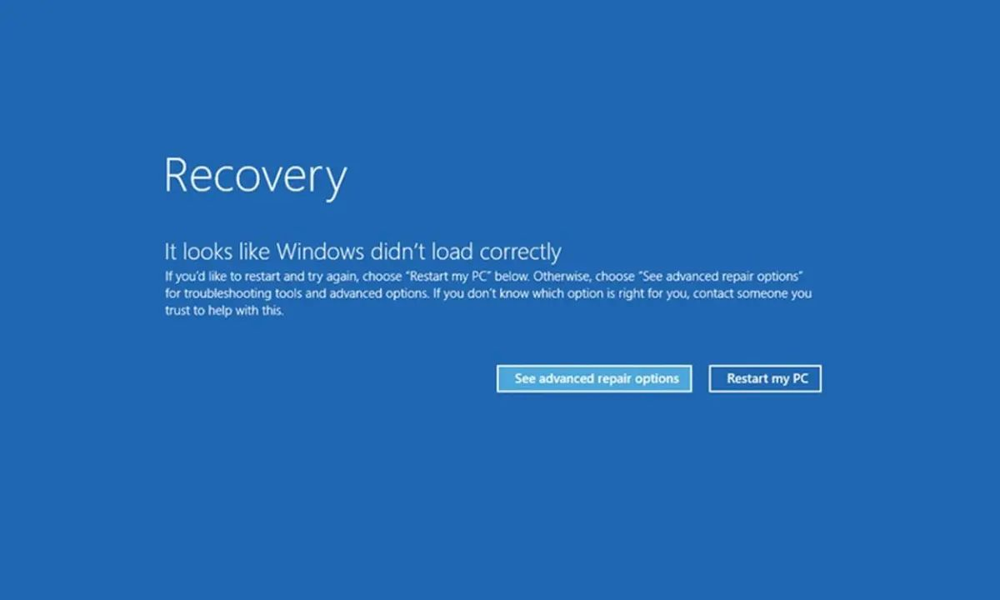

# Code Smell 260 - Crowdstrike NULL


*Avoiding the Null Trap in Privilege Mode Drivers*

> TL;DR: Using null pointers in critical code can crash your system

# Problems

* Memory access violation
    
* Unpredictable behavior
    
* Null Pointer Dereference

* Unexpected program termination

* System instability
    
* No healing/recovery strategy

* Security Risk
    
# Solutions

1. Avoid using [NULLs](https://github.com/mcsee/Software-Design-Articles/tree/main/Articles/Theory/Null%20-%20The%20Billion%20Dollar%20Mistake/readme.md)
    
2. Use [address sanitizers](https://github.com/google/sanitizers/wiki/AddressSanitizer)
    
3. Make controlled releases to mission-critical software
    
4. Create better rollback strategies instead of [BSOD](https://en.wikipedia.org/wiki/Blue_screen_of_death)

5. Use Smart Pointers: Manage memory automatically and avoid null pointers with smart pointers
    
6. Create self-healing software.

7. Apply defensive programming

8. Improve your QA tests before deploying to production.
    


# Context

When you use nulls in a privileged driver, you risk causing serious issues.

Privilege mode drivers run with high permissions, and if you use a null pointer, the system might try to access an invalid memory address.

For example, trying to read from address 0x9c (156) or using 0x0 as a special value can lead to critical errors.

You can't just abort the program in privileged mode, so you must handle these cases carefully.

In privileged drivers, null pointer usage poses significant risks. You can mitigate these risks using modern C++ features like *std::optional*.

[This problem](https://x.com/perpetualmaniac/status/1814376668095754753) caused one of the worst software blackouts in 2024.

# Sample Code

## Wrong

<!-- [Gist Url](https://gist.github.com/mcsee/c908be6c215429cb57470523ba8505a3) -->

```cpp
// This case is not exactly what happened with Crowdstrike
// It is here for illustration purposes
void* get_data() {
  if (data_available) {
    return data_ptr;  // This could be null!
  } else {
    // Uh oh, what if data_ptr is null here?
    return NULL;  
    // Using Null to indicate no data
    // knowing Null is schizophrenic
  }
}

int process_data(void* data) {
  if (data != NULL) { 
    // Maybe a null check, but not guaranteed!
    // Accessing data... (crash if data is Null)
    return *data;
  }
  // No check? Silent failure or unexpected behavior.
  return -1;
}
```

## Right

<!-- [Gist Url](https://gist.github.com/mcsee/3e37b7540276272fdf9fc594ef4f6225) -->

```cpp
// You should ideally replace the null with a polymorphic call
// You can see the technique in related articles

std::unique_ptr<int> get_data() { 
  if (data_available) {
    return std::make_unique<int>(data_value);
  } else {
    return nullptr;  // Explicitly return nullptr
  }
}

int process_data(const std::unique_ptr<int>& data) {
  if (data) { // Check for valid pointer
    return *data;
  } else {
    // Handle no data case (e.g., return default value)
    return 0;
  }
}
```

# Detection

[X] Semi-Automatic

You can detect this smell by checking for null pointer usage in critical parts of your code. Look for functions that process pointers and see if they handle null pointers safely.

Human code reviews are good for checking this kind of problem.

# Tags

* Null
    
# Level

[x] Advanced

# AI Generation

AI generators can sometimes produce this smell, especially if they generate code without context about the environment where the code will run.

AI generators are fed with code with NULL usage even though [his creator told us](https://github.com/mcsee/Software-Design-Articles/tree/main/Articles/Theory/Null%20-%20The%20Billion%20Dollar%20Mistake/readme.md) to avoid it altogether.

# AI Detection

AI tools can detect this smell with specific instructions.

AI can be trained to identify code patterns.

Teaching it the nuances of privileged driver development and null safety best practices might require more advanced techniques.

Use static analysis tools to flag null pointer dereferences.

# Conclusion

Voyager 1's software has been running for more than 50 years.

It was designed to be robust, reliable, and redundant which is sadly uncommon in some immature systems in 2024.

Avoid using null pointers in privileged mode drivers.

I have written a book on [clean code](https://cleancodecookbook.com/) and a whole chapter [#15](https://learning.oreilly.com/library/view/clean-code-cookbook/9781098144715/ch15.html) on how to avoid NULL and all the consequences it carries.

Hopefully, Crowdstrike engineers will read it!

# Relations

[Code Smell 12 - Null](https://github.com/mcsee/Software-Design-Articles/tree/main/Articles/Code%20Smells/Code%20Smell%2012%20-%20Null/readme.md)

[Code Smell 126 - Fake Null Object](https://github.com/mcsee/Software-Design-Articles/tree/main/Articles/Code%20Smells/Code%20Smell%20126%20-%20Fake%20Null%20Object/readme.md)

[Code Smell 208 - Null Island](https://github.com/mcsee/Software-Design-Articles/tree/main/Articles/Code%20Smells/Code%20Smell%20208%20-%20Null%20Island/readme.md)

# More Info

[Null: The Billion Dollar Mistake](https://github.com/mcsee/Software-Design-Articles/tree/main/Articles/Theory/Null%20-%20The%20Billion%20Dollar%20Mistake/readme.md)

%[https://github.com/google/sanitizers/wiki/AddressSanitizer]

[Technical Information](https://x.com/perpetualmaniac/status/1814376668095754753)

# Disclaimer

Code Smells are my [opinion](https://github.com/mcsee/Software-Design-Articles/tree/main/Articles/Blogging/I%20Wrote%20More%20than%2090%20Articles%20on%202021%20Here%20is%20What%20I%20Learned/readme.md).

---

> I couldn't resist the temptation to put in a null reference, simply because it was so easy to implement. This has led to innumerable errors, vulnerabilities, and system crashes, which have probably caused a billion dollars of pain and damage in the last forty years.

_Tony Hoare_

[Software Engineering Great Quotes](https://github.com/mcsee/Software-Design-Articles/tree/main/Articles/Quotes/Software%20Engineering%20Great%20Quotes/readme.md)

---

This article is part of the CodeSmell Series.

[How to Find the Stinky Parts of your Code](https://github.com/mcsee/Software-Design-Articles/tree/main/Articles/Code%20Smells/How%20to%20Find%20the%20Stinky%20parts%20of%20your%20Code/readme.md)