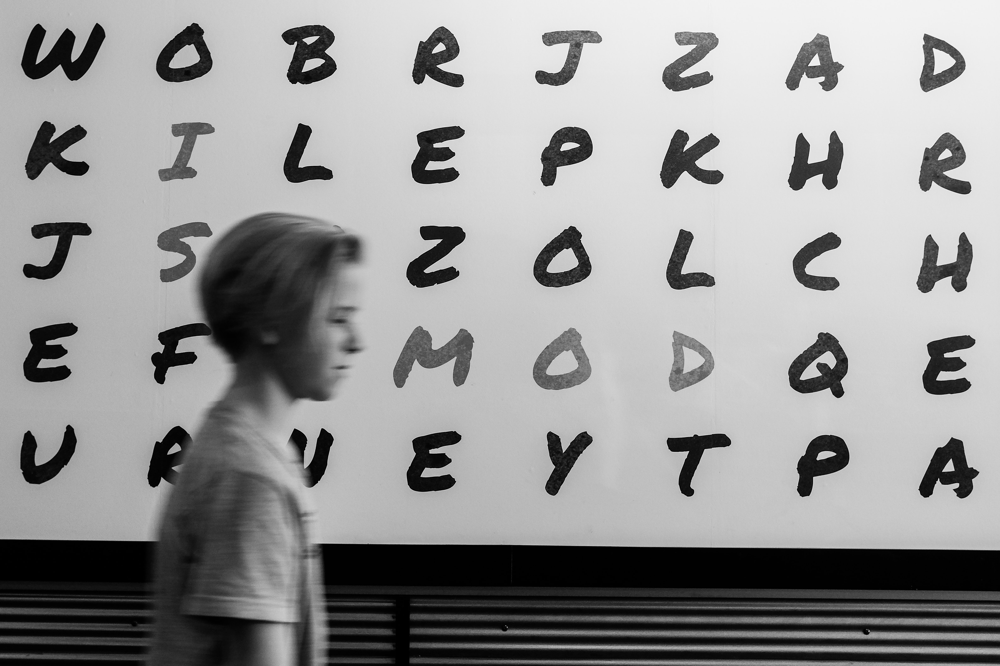

# Code Smell 41 - Regular Expression Abusers



*RegEx are a wonderful tool, we should to use them carefully and not to look smart.*

# Problems

- Readability

- Maintainability

- Testability

- Intention Revealing

# Solutions

1. Use regular expression just for string validation. 

2. If you need to manipulate objects, don't make them strings. 

# Sample Code

## Wrong

[Gist Url]: # (https://gist.github.com/mcsee/d0e8d1c002a12a9f535ab2fef4440d31)
```perl
val regex = Regex("^\\+(?:[0-9a-zA-Z][– -]?){6,14}[0-9a-zA-Z]$")
``` 

## Right

[Gist Url]: # (https://gist.github.com/mcsee/f3df119d3be0cdfee7fddd6d725f92be)
```perl

val prefix = "\\+"
val digit = "[0-9a-zA-Z]"
val space = "[– -]"
val phoneRegex = Regex("^$prefix(?:$digit$space?){6,14}$digit$")
``` 

# Detection

Regular expressions are a valid tool.
There's not much automated way of checking for possible abusers. A whitelist might be of help.
 
 # Tags

-  Primitive Obsession

- Abusers

# Conclusion

Regular expressions are a great tool for string validation. We must use them in a declarative way and just for strings.

Names are very important to understand pattern meanings.

If we need to manipulate objects or hierarchies, we should do it in an *object way*.

Unless we have a conclusive benchmark of **impressive** performance improvement.  
 
# Relations

[Code Smell 06 - Too Clever Programmer](Code Smells\Code Smell 06 - Too Clever Programmer)

[Code Smell 20 - Premature Optimization](Code Smells\Code Smell 20 - Premature Optimization) 

# More info

[What exactly is a name — Part I The Quest](Theory\What exactly is a name — Part I The Quest)

# Credits

Photo by [John Jennings](https://unsplash.com/@john_jennings) on [Unsplash](https://unsplash.com/s/photos/letters)

* * *

> A Perl program is correct if it gets the job done before your boss fires you. 

_Larry Wall_
 
[Software Engineering Great Quotes](Quotes\Software Engineering Great Quotes)

* * *

This article is part of the CodeSmell Series.

[How to Find the Stinky parts of your Code]()


