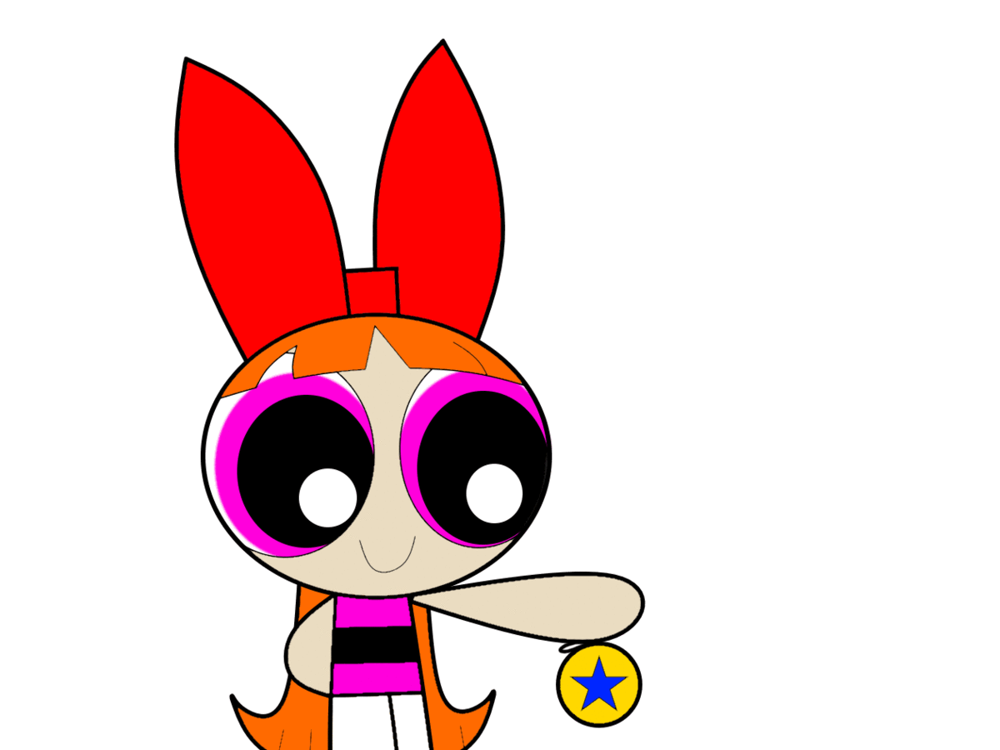

# Code Smell 58 - Yo-yo Problem



*Searching for a concrete method implementation? Go back and forth, up and down.*

TL;DR: Don't ab(use) hierarchies.

# Problems

- Deep Hierarchies

- Subclassification for Code Reuse

- Readability 

- Low Cohesion

- High Coupling
 
# Solutions

1.  Favor composition over inheritance.

2. Refactor deep hierarchies.

# Sample Code

## Wrong

[Gist Url]: # (https://gist.github.com/mcsee/85826dec4db583e6301c9c45a625a246)
```php
<?

abstract class Controller {

}

class BaseController extends Controller {

}

class SimpleController extends BaseController {

}

class ControllerBase extends SimpleController {

}

class LoggedController extends ControllerBase {

}

class RealController extends LoggedController {

}

```

## Right

[Gist Url]: # (https://gist.github.com/mcsee/d50419e3b895ee4d4341ca3c31faa091)
```php
<?

interface ControllerInterface {
  
}

abstract class Controller implements ControllerInterface {

}

final class LoggedControllerDecorator implements ControllerInterface {

}

final class RealController implements ControllerInterface {

}
```

# Detection

Any linter can check for suspects against a max depth threshold.

# Tags

- Hierarchy

# Conclusion

Many novice programmers reuse code through hierarchies. This brings high coupled and low cohesive hierarchies. 

[Johnson and Foote](http://www.laputan.org/drc.html) established in their paper this was actually a good design recipe back in 1988. We have learned a lot from there.

We must refactor and flatten those classes.

# Relations

[Code Smell 11 - Subclassification for Code Reuse](Code Smells\Code Smell  11 - Subclassification for Code Reuse)

# More info

%[https://en.wikipedia.org/wiki/Yo-yo_problem]

[Coupling - The one and only software design problem](Theory\Coupling - The one and only software design problem)

[c2](https://wiki.c2.com/?DeepClassHierarchies)

[Hierarchies should be deep by Johnson and Foote](http://www.laputan.org/drc.html)
 
* * *

>   An error arises from treating object variables (instance variables) as if they were data attributes and then creating your hierarchy based on shared attributes. Always create hierarchies based on shared behaviors, side.

_David West_
 
* * *
 
[Software Engineering Great Quotes](Quotes\Software Engineering Great Quotes)

* * *

This article is part of the CodeSmell Series.

[How to Find the Stinky parts of your Code]()