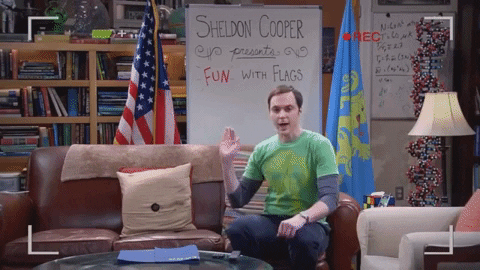

# Code Smell 62 - Flag Variables



*Flags indicate what happened. Unless their name is too generic.*

# Problems

-  Readability
 
- Maintainability

- Coupling

# Solutions

1.  Use meaningful names

2. Try to avoid flags. They generate coupling.

# Sample Code

## Wrong

[Gist Url]: # (https://gist.github.com/mcsee/694068de9cd2bbb8592d1a14bd89fe9e)
```php
<?

function dummy() {

    $flag = true;

    while ($flag == true) {

        $result = doSomething();
        if ($result) {
            $flag = false;
        }
    }
}
```

## Right

[Gist Url]: # (https://gist.github.com/mcsee/8a0de13a6fb13ae4da9c51a1b91c9705)
```php
<?

function dummyFunction()
{
    $atLeastOneElementWasFound = true;

    while (!$atLeastOneElementWasFound) {

        $elementSatisfies = doSomething();
        if ($elementSatisfies) {
            $atLeastOneElementWasFound = true;
        }
    }
}
```

# Detection

We can search all the code for bad named flags.

# Tags

- Readability

# Conclusion

Flags are widespread on production code. We should restrict their usage and use clear and intention revealing names.
 
# Relations

[Code Smell 51 - Double Negatives](Code Smells\Code Smell 51 - Double Negatives)

[Code Smell 07 - Boolean Variables](Code Smells\Code Smell 07 - Boolean Variables)

# More Info

%[https://en.wikipedia.org/wiki/Boolean_flag]

[What exactly is a name — Part II Rehab](Theory\What exactly is a name — Part II Rehab)

* * *

> If you lie to the compiler, it will get its revenge.

_Henry Spencer_

* * *
 
[Software Engineering Great Quotes](Quotes\Software Engineering Great Quotes)

* * *

This article is part of the CodeSmell Series.

[How to Find the Stinky parts of your Code](Code Smell\How to Find the Stinky parts of your Code)