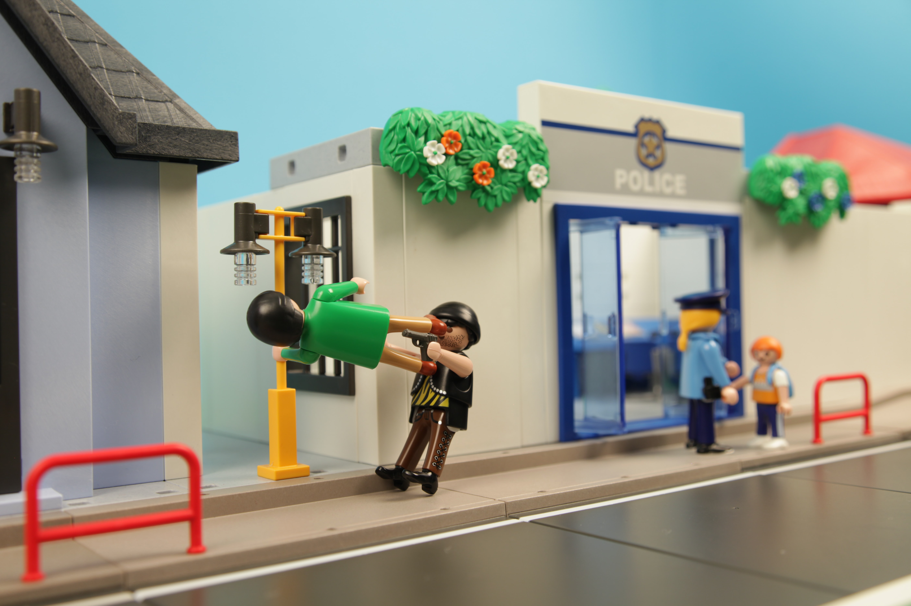

# Code Smell 67 - Middle Man



*Let's break Demeter's Law.*

# Problems

- Unnecessary Indirection

- Empty Classes

- Readability

# Solutions

1. Remove Middle man.

# Sample Code

## Wrong

[Gist Url]: # (https://gist.github.com/mcsee/8f89b53d0be21a6779e4be53673edf5c)
```java
public class Client {
    Address address;
    public ZipCode zipCode() {
        return address.zipCode();
    }
}

public class Address {
    private ZipCode zipCode;
    
    public ZipCode zipCode() {
        return new ZipCode('CA90210');
    }
}

public class Application {   
   ZipCode zipCode = client.zipCode();
}
```

## Right

[Gist Url]: # (https://gist.github.com/mcsee/63674fe800fca77d3a7edc39bde428c8)
```java
public class Client {
    Address address;
    // client now has to expose its address
    public address() {
        return address;
    }
}

public class Address {
    private ZipCode zipCode;
    
    public ZipCode zipCode() {
        return new ZipCode('CA90210');
    }
}

public class Application {   
   ZipCode zipCode = client.address().zipCode();
}
```

# Detection

Same as its [opposite smell](Code Smells\Code Smell 08 - Long Chains Of Collaborations), We can detect this small using parsing trees.

# Tags

- Coupling

- Declarative

- Readability

# Conclusion

This is exactly the opposite to [Message Chain](Code Smells\Code Smell 08 - Long Chains Of Collaborations). We make explicit the message chain. 

# Relations

[Code Smell 08 - Long Chains Of Collaborations](Code Smells\Code Smell 08 - Long Chains Of Collaborations)

[Code Smell 114 - Empty Class](Code Smells\Code Smell 114 - Empty Class)

# More info

(Refactoring Guru)[https://refactoring.guru/smells/middle-man]

(Refactoring.com)[https://refactoring.com/catalog/removeMiddleMan.html]

(C2 Wiki)[https://wiki.c2.com/?MiddleMan]

(JetBrains)[https://www.jetbrains.com/help/idea/remove-middleman.html#remove_middleman_example]

(Wikipedia)[https://en.wikipedia.org/wiki/Law_of_Demeter]

# Credits

Photo by [Dan Counsell](https://unsplash.com/@dancounsell) on [Unsplash](https://unsplash.com/s/photos/robber)
  
* * *

> Whenever I have to think to understand what the code is doing, I ask myself if I can refactor the code to make that understanding more immediately apparent.

_Martin Fowler_

* * *
 
[Software Engineering Great Quotes](Quotes\Software Engineering Great Quotes)

* * *

This article is part of the CodeSmell Series.

[How to Find the Stinky parts of your Code]()