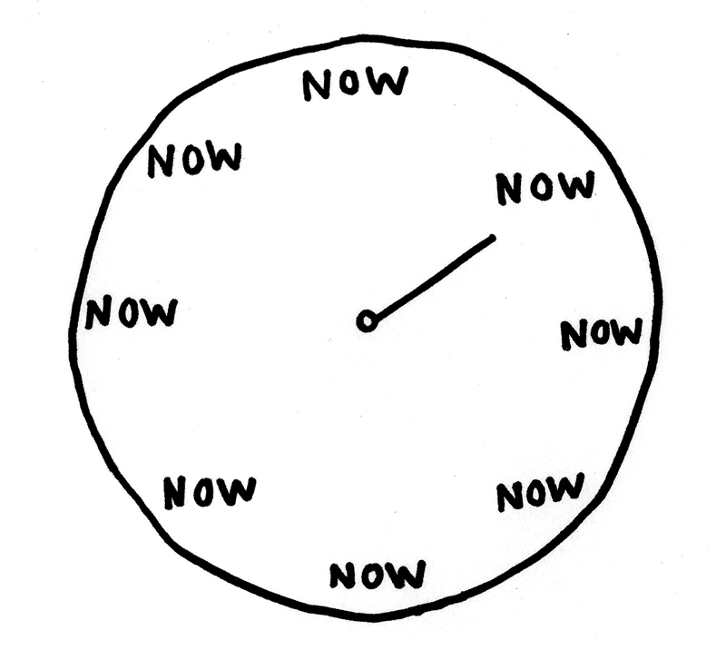

# 16 Simple Tips to Boost Your Productivity x10

*These easy-to-follow tips will improve your output dramatically.*

# 1. Remove Notifications 🔔

- Check your phone after a couple of hours. 
- Keep an eye on the app with the most notifications.
- Block them.
- Don't fear *[FOMO](https://en.wikipedia.org/wiki/Fear_of_missing_out)*.
- Choose your shots.
- You are going to lose some content around.
- Deal with it.
- Watch [The Social Dilemma](https://www.imdb.com/title/tt11464826/).

# 2. Slice your time 🍕

- Use blocks of time without interruptions (timeboxing).
- My favorite is [Pomodoro Technique](https://en.wikipedia.org/wiki/Pomodoro_Technique).
- If you come across new tasks write them down.
- Don't multitask.
- You cannot switch until time is up.
- 20 minutes it's a good slice.

# 3. Inbox0 📥

- Keep your inbox ALWAYS empty.
- Unsubscribe to all irrelevant mails (most of the time is a just-one-click).
- Create filtering rules - out of the inbox.
- If you need to action on mails: (keep the list out, create a special folder).
- Inbox is not a To-do list.

# 4. Find your Flow 🕯️

- Creative work happens on [flow state](https://en.wikipedia.org/wiki/Flow_(psychology).
- Takes some time to enter flow (about 15 mins).
- Takes one second to leave it and go to the queue again.
- Remove all external flow interruptions, notifications, noise
- Control all internal stimulus.

# 5. Use [Zenware](https://searchunifiedcommunications.techtarget.com/definition/zenware) 💭

- Use simple software.
- Minimalistic tasks editors like [writemonkey](https://writemonkey.com/) and simple managing software like [Trello](https://trello.com/)
- If you blog on @hashnode you will find its markup editor very convenient.
- Don't procrastinate gold plating your articles.

# 6. Close Your Browser Tabs 🔓

- Manage to-do lists and items.
- Do not open multiple tabs.
- No operating system or web browser handles them very well. Neither you.
- Don't multitask.
- If something takes less than two minutes do it. Else add it to To-Do list.
- Web tabs are not to-do lists.

# 7. Find *Homes* for everything 🏠

- Every object (real or virtual) should have a home.
- We can keep inboxes (or incoming places) for things a couple of days.
- We need brief processes to empty those inboxes.
- When emptying those inboxes we should define new 'homes' if necessary.

# 8. Keep a Daily Agenda 📅

- Start each day with a short daily agenda.
- You can mix personal and work items or keep them in two separate lists.
- Plan for unplanned work.
- Revisit hourly to keep up.
- And close it at night.
- Never reuse it for the next day. Start from scratch.

# 9. Automate Repetitive Tasks 🤖

- Find repeatable shortcuts.
- Automate repetitive tasks.
- It is a two sharp blade. Never automate when DOING a task.
- Automating is more enjoyable than doing (Procrastination).
- Automate only tasks made on daily basis.
- Don't automate infrequent things.

# 10. Avoid Unproductive Meetings 🤝

- Schedule meetings for 25 or 50 minutes.
- So you can have time to switch.
- Meetings without agenda are useless.
- Avoid meetings with more than three people.
- The outcome of the meeting should be action items.

Commitments must include:
- who / what / when

# 11. Avoid Multitasking 👨‍💼

- Don’t multitask. 
- Work on one task at a time. 
- Multitasking is a myth, and trying to do it only splits your focus.
- Human Brain is monotask.
- Context Switching for neurons is too expensive, so you are thrashing most of the time.

Focus -> Flow.

# 12. Avoid Voice Calls 📞

- Voice Calls are interruptions.
- Interruptions are our worst enemy.
- Avoid unscheduled voice calls.
- If it is not urgent you can talk via messaging in an asynchronous way.
- If it is urgent, double check it is urgent
- If you wanna talk, schedule!

# 13. [Eat the Frog](https://todoist.com/productivity-methods/eat-the-frog) Early in the Morning 🌤️

- Do the annoying tasks early in the morning.
- Plan for the day.
- Review everything accomplished the day before.

# 14. Don't reuse daily to-do lists ✔️

- Start each day with a different one.
- With this method there's no carry over.
- Daily check yesterday's unfinished goals and evaluate if they deserve being on the new list.

# 15. Measure Objectives 📈

- Set long term, middle term and short term goals.
- They should not be fuzzy.
- Set a realistic and measurable metric.
- If it is not measurable with exit condition it is not a goal.
- Keep track on them on a weekly basis.
- Change it if need it.

# 16. Don't Save for Later 🍓

- Save for later is a myth.
- There are excellent apps like 
[Pocket](https://getpocket.com/), [Inoreader](https://www.inoreader.com/), [Evernote](https://evernote.com/), etc
- But unless you consume the list often this will grow forever.
- Don't save content, consume it.
- Don't [Hoard](https://en.wikipedia.org/wiki/Digital_hoarding is a disorder).

* * *

I'm sure there are plenty of Productivity advices around. Which one does work for you? 

Please leave me a comment.