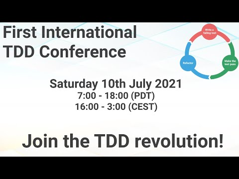

# TDD Conference 2021 - Opening Ceremony by Alex Bunardzic

First International Test Driven Development took place on July 30th. 

In this series, I will include every talk together with my notes and further reading.

Hopefully, a lot of readers will watch and rewatch the talks, as they are worth several reviews.

Let's start...

# Opening Ceremony by Alex Bunardzic

## Bio 

Alex is a software engineering veteran with over 30 years of hands-on professional experience. A staunch advocate of Extreme Programming and TDD, Alex is currently leading DevOps teams by coaching them in TDD practices. 

With a science background, Alex shows us how to build software by watching nature

> TL;DR: Setting the stage for the TDD revolution, how did it all begin and where are we today with TDD.

## Talk

%[https://youtu.be/-_noEVCR__I?t=333]

# My Personal notes

- This is the first conference and the passing torch to younger generations of TDD enthusiasts.
- We discovered TDD several years ago thanks to Kent Beck.
- We evolved with James Grenning's [Zombies Formula](TDD\How I Survived the Zombie Apocalypse).
- Ron Jeffries' Never let the code not be working.
- And so on...

## Why TDD?

- TDD is not as easy to sell as clean code, agility, secure architectures.
- We will consider it, but there's no time now.

## TDD as a scientific method

- Based on positive enforcement and short feedback loops.
- Watching nature phenomena.
- Everything happens as a response to what happened earlier.

## The Four current problems when we try to plan

- Uncertainty
- Ambiguity
- Incompleteness
- Confusion

## TDD Breakthroughs

- TDD Removes non-productive code.
- Less Debugger time.
- No more manually run the app.
- No different manual test scenarios, credentials, navigation, configuration, environments, etc.

# Speaker Links

- Twitter [@alexbunardzic](https://twitter.com/alexbunardzic)
- Medium [@alex-bunardzic](https://medium.com/alex-bunardzic)
- LinkedIn [@alexbunardzic](https://www.linkedin.com/in/alexbunardzic)
- @[Alex Bunardzic](@alexbunardzic)

* * *

# Index

[TDD Conference 2021 - All Talks](TDD Conference 2021\TDD Conference 2021 - All Talks)

* * *

Please follow TDD Conference on:

- [YouTube](https://www.youtube.com/channel/UCKn-DadPoyYssfAOMk1LSew)
- [Twitter](https://twitter.com/tddconf)