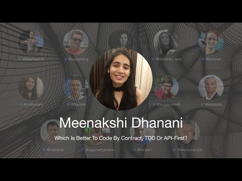

# TDD Conference 2021 - Meenakshi Dhanani - Which is better to Code by Contract TDD or API-first

First International Test Driven Development took place on July 30th. 

In this series, I will include every talk together with my notes and further reading.

Hopefully, a lot of readers will watch and rewatch the talks, as they are worth several reviews.

Let's continue...

## Bio 

Meenakshi Dhanani works as a Developer Advocate at Postman where she advocates best practices for Postman, the larger API community, and an API-first approach to software development. She was previously a software consultant at ThoughtWorks, where she trained employees and worked on projects applying XP (extreme programming) practices - TDD, CI/CD, pair programming by the book.
 
> TL;DR: TDD and API-First are complementary techniques. We should embrace contracts.

## Talk

%[https://www.youtube.com/watch?v=oTDei7E9XQM]

# My Personal notes

- We make cakes by contracts we agree (the blueprint).
- A contract is an agreement.
- We should always focus on the contract and not the implementation to avoid overengineering.
- Designing by contracts leads to good design from the user perspective.
- With contracts, we have more predictable integration.
- Some Code by contract alternatives are:
-- TDD
-- [API-First development](https://blog.dreamfactory.com/api-first-the-advantages-of-an-api-first-approach-to-app-development/)
-- [BDD](https://en.wikipedia.org/wiki/Behavior-driven_development)
-- [Design by Contract](https://en.wikipedia.org/wiki/Design_by_contract).
- on TDD writing the tests first, avoids focusing on implementation early.
- TDD is mistakenly focused on the tests instead of how it guides software development.
- We play on the [workplace](https://www.postman.com/devrel/workspace/which-is-better-to-code-by-contract-tdd-or-api-first/overview) using a mock server.
- The emphasis is on what the API wants to expose
- We quickly compare TDD with API-First. They are complementary.
-- We can use them in tandem.

# Speaker Links

- Twitter [@mdhananii](https://twitter.com/mdhananii)
- Medium[@meenakshi-dhanani](https://meenakshi-dhanani.medium.com/)
- LinkedIn [@meenakshi-dhanani](https://www.linkedin.com/in/meenakshi-dhanani/)
- [Postman](https://community.postman.com/t/june-10-which-is-better-to-code-by-contract-tdd-or-api-first/25655/5)
- [Workplace](https://www.postman.com/devrel/workspace/which-is-better-to-code-by-contract-tdd-or-api-first/overview)

* * *

# Index

[TDD Conference 2021 - All Talks](TDD Conference 2021\TDD Conference 2021 - All Talks)

* * *

Please follow TDD Conference on:

- [YouTube](https://www.youtube.com/channel/UCKn-DadPoyYssfAOMk1LSew)
- [Twitter](https://twitter.com/tddconf)