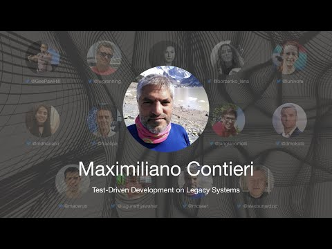

# TDD Conference 2021 - Test-Driven Development on Legacy Systems - Maximiliano Contieri

First International Test Driven Development took place on July 10th. 

In this series, I will include every talk together with my notes and further reading.

Hopefully, a lot of readers will watch and rewatch the talks, as they are worth several reviews.

Let's continue...

## Bio 

Maxi has a PhD in computer science. 
He has been teaching software engineering and working in industry for 25 years. 
He adopted TDD in the mid-2000s and built a financial system from scratch with 25,000 automated tests. Since then, he has been enhancing existing legacy applications by refactoring them with TDD as well. 
He frequently blogs about software design, code smells, and clean code.
 
> TL;DR: We have no excuses to use TDD everywhere 

## Talk

%[https://www.youtube.com/watch?v=Gcx6fosO4t0]

*This is my own talk. My own notes will not be very accurate* 😇

# My Personal notes

- TDD is a *development* methodology. Not a testing one.
- It favours KISS and YAGNI principles.
- Systems are less coupled when developed with TDD 
- We promote baby steps
- Myth: *TDD Guaranties good designs*
- We require no side effects on tests. We must be in full control
- Myth: *We cannot use TDD on coupled systems*
- Myth: *TDD cannot be used to improve system performance*
- First names are always very bad
- We should use IDEs and not text editors
- We start TDD with Zombies
- Myth: *Hardcoding is a bad practice*
- Myth: *We can write algorithms without test cases*
- We cannot refactor and change test at the same time
- Myth: *During TDD Process, only the programmers create the tests*
- QAs, Peer Reviewers, Technical support and product owners define the tests
- Myth: *We should test private methods*

# Speaker Links

- Twitter [@mcsee1](https://twitter.com/mcsee1) 
- LinkedIn [@mcsee](https://www.linkedin.com/in/mcsee/)
- DevTo [@mcsee](https://dev.to/mcsee)
- Site [https://maximilianocontieri.com](https://maximilianocontieri.com)
- Medium [https://mcsee.medium.com/](https://mcsee.medium.com/)
 
* * *

# Index

[TDD Conference 2021 - All Talks](../../TDD%20Conference%202021/TDD%20Conference%202021%20-%20All%20Talks/readme.md)

* * *

Please follow TDD Conference on:

- [YouTube](https://www.youtube.com/channel/UCKn-DadPoyYssfAOMk1LSew)
- [Twitter](https://twitter.com/tddconf)

