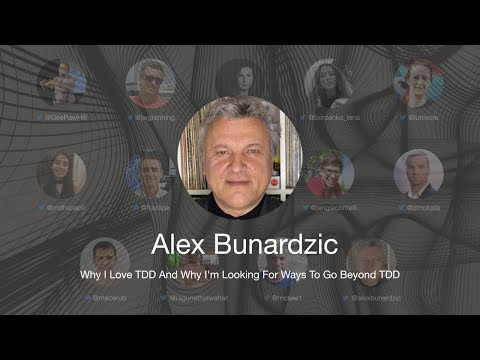

# TDD Conference 2021 - Why I Love TDD And Why I'm Looking For Ways To Go Beyond TDD - Alex Bunardzic

First International Test Driven Development took place on July 10th. 

In this series, I will include every talk together with my notes and further reading.

Hopefully, a lot of readers will watch and rewatch the talks, as they are worth several reviews.

Let's continue...

## Bio 

Alex is a software engineering veteran with over 30 years of hands-on professional experience. A staunch advocate of Extreme Programming and TDD, Alex is currently leading DevOps teams by coaching them in TDD practices. 
 
> TL;DR:  We need superfast feedback. TCR does it very well

## Talk

%[https://www.youtube.com/watch?v=U1j9tGLo-wM]

# My Personal notes

- We spend half our time playing the guitar and the other half tuning it
- The longer we wait before we make a change and see its impact, the more we dive in the dark
- We need to shorten the feedback loop
- We should deploy every keystroke to production like collaborating on Google Docs
- Creating from scratch a [TCR](https://medium.com/@kentbeck_7670/test-commit-revert-870bbd756864) system with an automated script going to commit or revert according to test results.
- We go from a steady state to another steady state
- We are driven by symmetry
- As always, we start faking it until we start making it
- Prime directive is for system to be always up and running
- Once we write many tests, we can run mutation testing
- Accidental complexly is the pain on our systems
 
# Speaker Links

- Twitter [@alexbunardzic](https://twitter.com/alexbunardzic) 
- LinkedIn [@alexbunardzic](https://www.linkedin.com/in/alexbunardzic/) 
- Medium [https://medium.com/alex-bunardzic/](https://medium.com/alex-bunardzic)

* * *

# Index

[TDD Conference 2021 - All Talks](../../TDD%20Conference%202021/TDD%20Conference%202021%20-%20All%20Talks/readme.md)

* * *

Please follow TDD Conference on:

- [YouTube](https://www.youtube.com/channel/UCKn-DadPoyYssfAOMk1LSew)
- [Twitter](https://twitter.com/tddconf)