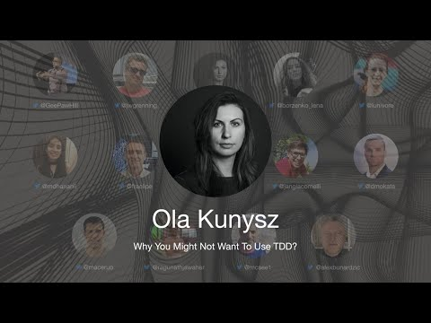

# TDD Conference 2021 - Why You Might Not Want To Use TDD - Ola Kunysz

First International Test Driven Development took place on July 30th. 

In this series, I will include every talk together with my notes and further reading.

Hopefully, a lot of readers will watch and rewatch the talks, as they are worth several reviews.

Let's continue...

## Bio 

Ola Kunysz is a software engineer with 14 years of experience. Besides coding, she has experience in business analysis and consulting. Since 2019 she runs her own company, educating programmers about software quality. She speaks at conferences, writes articles and produces online courses. Her biggest interest is solving real-life problems and writing code that matters. For 2 years, she organized meetups and workshops of Geek Girls Carrots in Wrocław, Poland. She enjoys meeting people and working on interesting projects, so you can spot her on hackathons and conferences. When it’s time to relax, she’s offline [with dog (s), playing board games, in the mountains]
 
> TL;DR: TDD can be hard to start and level up, but it is worth it!

## Talk

%[https://www.youtube.com/watch?v=K-tDuE2tN0c]

# My Personal notes

- TDD is a life-changing technique.
- TDD changes the way you code. It is more declarative and simple.
- We need to introduce very simple baby steps.
- You come back to requirements all the time.
- Simple doesn't mean is easy.
- We don't feel comfortable with the red color.
- Also, green tests are sometimes false negatives. We don't know if everything is working, or we made them wrong.
- Tests are our friends, not our enemies.
- TDD is especially hard and challenging for senior developers, since they have bad habits.
- Mastering new skills is easier for juniors.
- We should learn TDD by watching live coding, not only by reading books.
- It is hard to follow the simple process. Steps are so small we tend to skip them.
- We tend to skip baby steps and move ahead with the already known solution.
- We don't see TDD benefits early. Sometimes you need days or weeks to see the whole picture. Some people give up too early.
- We need to stay humble and follow the process.
- TDD is hard to start or level up to real large projects.
- We should never force people to use TDD.
- We must practice with [Katas](http://codingdojo.org/kata) to move to larger projects.
- Always follow the process without early judging.

> Programmers don't write to check anything. They just test to prove they are right.

# Speaker Links

- Twitter [@olaqnysz](https://twitter.com/olaqnysz) 
- LinkedIn [@akunysz](https://www.linkedin.com/in/akunysz/)
- DevTo [@olaqnysz](https://dev.to/olaqnysz/)
- Site [https://socialshub.net/OlaKunysz](https://socialshub.net/OlaKunysz)
- Medium [https://medium.com/@OlaQnysz/](https://medium.com/@OlaQnysz/)

# Talk source 

https://dev.to/olaqnysz/why-you-might-not-want-to-use-tdd-26jf

* * *

# Index

[TDD Conference 2021 - All Talks](../../TDD%20Conference%202021/TDD%20Conference%202021%20-%20All%20Talks/readme.md)

* * *

Please follow TDD Conference on:

- [YouTube](https://www.youtube.com/channel/UCKn-DadPoyYssfAOMk1LSew)
- [Twitter](https://twitter.com/tddconf)

