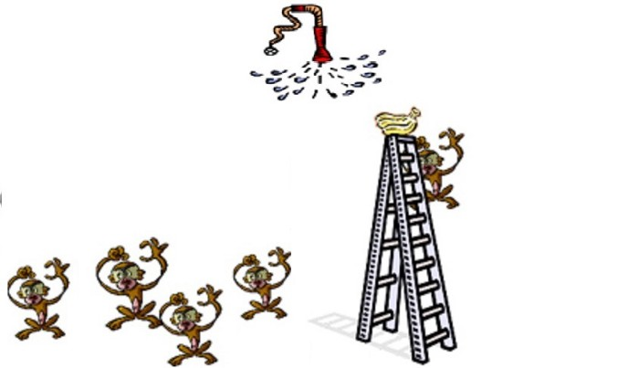

# Programming as Theory Building

> TL;DR: We review Peter Naur's article on software development

Building models and solutions in software is not just about programming. We will review Peter Naur's classic paper.

*This classic article from 1985 anticipated many of the concepts that are in common use in the industry today.
There are other interesting inspirational ideas from the paper that we have not yet taken advantage of.*

# Historic context

Peter Naur's [paper from 1985](https://gist.github.com/dpritchett/fd7115b6f556e40103ef) brings us concepts that still go unnoticed today.

Written documentation was the model to follow.

The [Cascading Lifecycle](https://en.wikipedia.org/wiki/Waterfall_model) reigned supreme and was the industry standard.
Peter Naur calls us to reflect on our profession and brings us concepts that are still very relevant 25 years later.

Peter Naur was a Danish scientist, winner of a [Turing Award](https://en.wikipedia.org/wiki/Turing_Award) (equivalent to the Nobel Prize in computing).

He participated in the development of [Algol 60](https://en.wikipedia.org/wiki/ALGOL_60) and helped create the syntax model [BNF](https://en.wikipedia.org/wiki/Backus%E2%80%93Naur_form) that all programming languages ​​use to define their grammar.

By 1985, Naur had discovered the difficulty in the education of computer professionals and its radical difference from other engineering disciplines.

His collaborative and human conception always contrasted with the Taylorist concepts of software development that see activities as watertight compartments, and human beings as interchangeable pieces.

Naur's epistemological approach, based on incremental iterative learning, contrasts with mathematics represented by the formal ideas of [Dijkstra](https://en.wikipedia.org/wiki/Edsger_Dijkstra).

## Theory-Building

The paper presents novel ideas for the time, then taken up by the [agile manifesto](https://agilemanifesto.org/) placing humanistic values ​​of knowledge acquisition over the Taylorist vision of software building.

The theory is built by observing reality as in scientific procedure. 

The individuals jointly assemble the emergent knowledge of said observations. 

The **whole** is greater than **the sum of the parts** as Aristotle correctly predicted.

The programming phase corresponds to the implementation stage of said theory in a machine.

This idea is partially contradicted by techniques such as [TDD](https://en.wikipedia.org/wiki/Test-driven_development) where knowledge training is encouraged while the solution is implemented.

[What is (wrong with) software?](https://github.com/mcsee/Software-Design-Articles/tree/main/Articles/Theory/What%20is%20(wrong%20with)%20software/readme.md)

## Documentation of findings

According to Naur, the software developed and the accompanying documentation is not enough to express the design ideas developed in theory.

Ideas exist only among the individuals who formulated them.

Therefore, the loss of any of its members fragments the collectively generated knowledge.

## Agile ahead of time

The [agile manifesto](https://agilemanifesto.org/) is based on four pillars:

1 **Individuals and interactions** over processes and tools

*This corresponds to Naur's ideas about the importance of people who are shaping knowledge.*

2 **Working software** over comprehensive documentation

*As we saw earlier, the documentation is irrelevant and is not a good starting point for further software development.*

3 **Customer collaboration** over contract negotiation

*Communication to build the theory between the people developing the software, and the domain experts, is essential for that theory to correspond to a useful solution. As a corollary, **only formal** communication between the parties is counterproductive.*

4 **Responding to change** over following a plan

*The theory developed is a process that does not have an initial plan or an end goal. It is an incremental spiral where theory adjusts to needs as it learns from the real-world.*

## Axioms don't matter

Peter Naur's theory is not based on formal axioms with postulates, derivation of theorems, or corollaries.
Instead, look for a declarative model that explains the business we are simulating.

This way of doing science is based on [Ryle](https://en.wikipedia.org/wiki/Gilbert_Ryle) which, in turn, is based on the constructivist's ideas about the language of [Wittgenstein](https://en.wikipedia.org/wiki/Ludwig_Wittgenstein).

Building software is acquiring knowledge. Trying to define the behavior of a class without having previously built any instance is a mistake.

[What exactly is a name - Part II Rehab](https://github.com/mcsee/Software-Design-Articles/tree/main/Articles/Theory/What%20exactly%20is%20a%20name%20-%20Part%20II%20Rehab/readme.md)

To build theory in an exploratory way, **prototyping languages** ​​are much more useful tools than **classification languages**.

Naur believes that there is no single scientific method but that there is a multiplicity of them. In accordance with [Feyerabend's](https://en.wikipedia.org/wiki/Paul_Feyerabend) ideas.

> This theory is understood as the knowledge a person must have in order not only to do things intelligently and well according to certain criteria but also to be able to explain, answer questions, argue or justify the activity of concern.

## Human beings are the center

The built theory cannot be expressed in the developed program. It can only be enunciated by the human beings who participated in its building.

> Software is the product of these ideas.

Before a [change of people](https://www.teldat.com/blog/en/software-as-a-product-of-intellectual-activity-reflections-on-software-development), a similar theory can be reconstructed from the artifacts. 

This theory will be ** incomplete and different ** to that elaborated by the original authors.

> The asset of a software company is not the lines of source code with intellectual property that only reflect explicit knowledge.
> The people who develop that theory and build that software possesses irreplaceable, and therefore valuable, implicit knowledge.

The theory builders are based on a certain paradigm, as established by [Kuhn](https://en.wikipedia.org/wiki/Thomas_Kuhn). The paper mentions that to know Newton's theory, it is not enough to read only the physical formulas.

> the person having the theory must have an understanding of the manner in which the central laws apply to certain aspects of reality, so as to be able to recognize and apply the theory to other similar aspects. A person having Newton’s theory of mechanics must thus understand how it applies to the motions of pendulums and the planets and must be able to recognize similar phenomena in the world, so as to be able to employ the mathematically expressed rules of the theory properly.

## If the model does not exist, the results will never be as expected

Naur begins the article by taking certain observations of what really happens with programs and the teams of programmers who deal with them, particularly in situations that arise from unexpected and erroneous executions or reactions of the software.

> The difficulty of accommodating such observations in a production view of programming suggests that this view is misleading. The theory-building view is presented as an alternative.

Building adequate self-defense models is not easy. It requires a long process of mastery learning. Its fruits allow us to mitigate risks and to be able to maintain the existing software.

[Fail Fast](https://github.com/mcsee/Software-Design-Articles/tree/main/Articles/Theory/Fail%20Fast/readme.md)

## There are no silver bullets

Naur rejects the idea of ​​a single method to develop software.

A development methodology, such as the one already mentioned [TDD](https://en.wikipedia.org/wiki/Test-driven_development), must be complemented with other practices.

The absence of the much desired [silver bullet](https://en.wikipedia.org/wiki/No_Silver_Bullet) is a sad reality, even these days.

## Language is accidental

According to Naur, the notation used to express this theory is accidental.

Today we know that language is an inseparable part of what it can express.

It is not the same to write an algorithm in a **declarative** language than in a **low-level** one.

Nor will we be able to express good business models in non-declarative languages ​​like C or GoLang.

In the same way that we should not describe chemical or physical equations in natural language, we should not express our theory in low-level languages.

The software should not be seen as the text that can be uploaded to a repository but as the **theory that supports it**.

Photo by [Roman Mager](https://unsplash.com/@roman_lazygeek) on [Unsplash](https://unsplash.com/s/photos/equation)

## Bad decisions

Throughout the theory-building process, those involved make decisions so that the model corresponds to the [bijection to the real-world](https://github.com/mcsee/Software-Design-Articles/tree/main/Articles/Theory/The%20One%20and%20Only%20Software%20Design%20Principle/readme.md]). These decisions are not explicitly documented.

Observing the result without knowing why a design decision was made is another limitation that a theory can explain but the built software cannot.

In legacy systems, it is common to see individuals act out of habit without wondering what reasons lead them to make decisions.

[How to Decouple a Legacy System](https://github.com/mcsee/Software-Design-Articles/tree/main/Articles/Theory/How%20to%20Decouple%20a%20Legacy%20System/readme.md)

## Where is the model?

According to Naur, the model should remain solely as a theory among the participants. However, if we stay true to bijection and create a model with a [MAPPER](https://github.com/mcsee/Software-Design-Articles/tree/main/Articles/Theory/What%20is%20(wrong%20with)%20software/readme.md) the model will be only as good as the theory developed in it.

[The One and Only Software Design Principle](https://github.com/mcsee/Software-Design-Articles/tree/main/Articles/Theory/The%20One%20and%20Only%20Software%20Design%20Principle/readme.md)

[GPT3](https://en.wikipedia.org/wiki/GPT-3) and the other [transformers](https://en.wikipedia.org/wiki/Transformer_(machine_learning_model)) are cornering programmers who write code without understanding the underlying theory. We still have time to avoid it.

[Most Programmers are losing our jobs](https://github.com/mcsee/Software-Design-Articles/tree/main/Articles/Opinion/(Most)%20Programmers%20are%20losing%20our%20jobs%20very%20soon/readme.md)

# Conclusion 🏁

Building software is a human activity.

Theory building is a mental activity that requires a process of learning and discussion until reaching a consensus.

------

Part of the objective of this series of articles is to generate spaces for debate and discussion on software design.

[Object Design Checklist](https://github.com/mcsee/Software-Design-Articles/tree/main/Articles/Theory/Object%20Design%20Checklist/readme.md)

We look forward to comments and suggestions on this article.