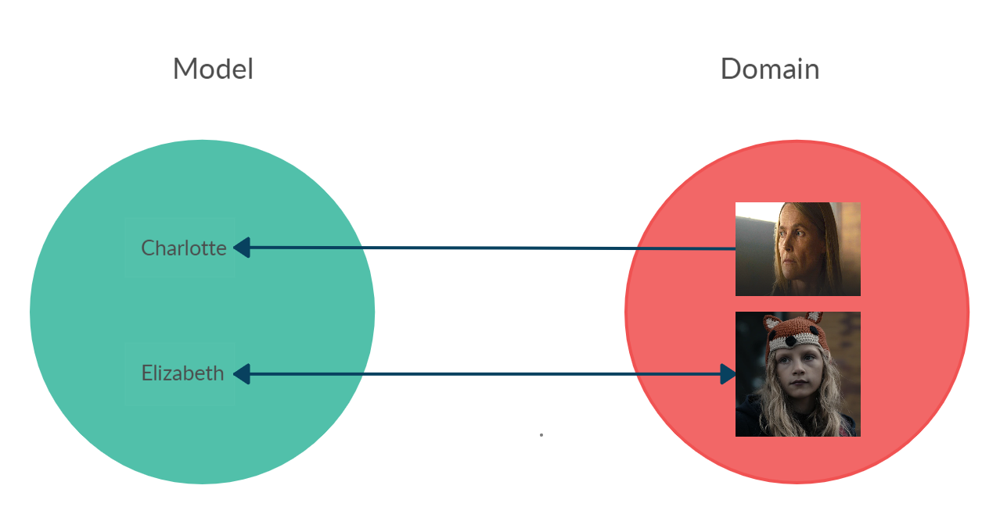
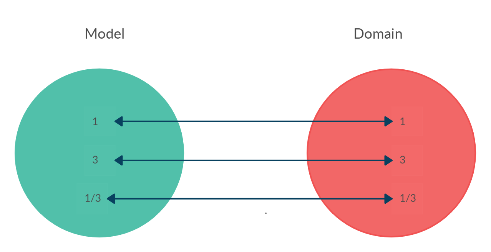
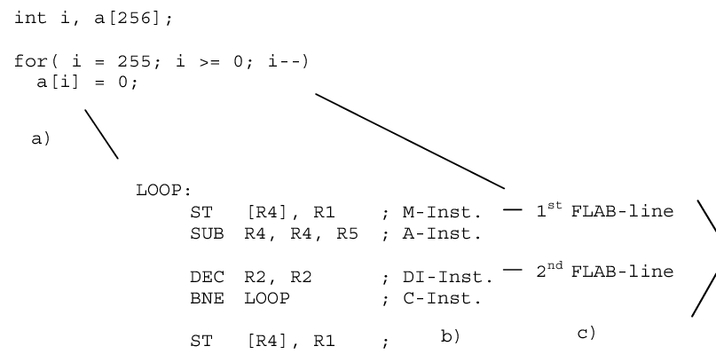
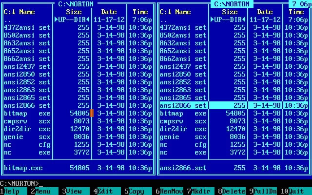
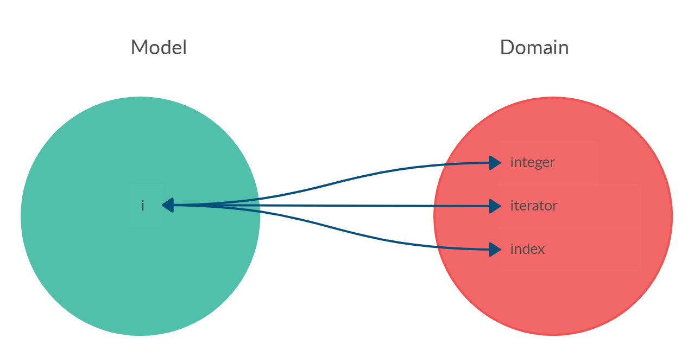

# What Exactly Is a Name? Part I: The Quest


*A good name is always the most important thing. Let’s find it.*

> TL;DR: How to find good names

All developers use names for programming; it doesn’t matter if the language is high or low level, whether it is Imperative, Functional, or [Object-Oriented](https://github.com/mcsee/Software-Design-Articles/tree/main/Articles/Explain%20in%205%20Levels/Explain%20in%205%20Levels%20of%20Difficulty%20Object-Oriented%20Programming/readme.md). 

Names are everywhere. But you still misuse them. 

In this first part, you will see how to find good ones.

> _There are only two hard things in Computer Science: cache invalidation and naming things._
> 
> _Phil Karlton_

## **What’s in a name?**

> **What’s in a name? That which we call a rose / By any other name would smell as sweet.**
> 
> William Shakespeare’s Romeo and Juliet.


# The Problem

Code is read many [more times than it is written](https://www.ybrikman.com/writing/2018/08/12/the-10-to-1-rule-of-writing-and-programming/). The first readings are made by the developer who chooses the names. 

Later, if the code survives, many other developers will make their own interpretations based on the footprints left by the original author.


Names lose meaning quickly.

Names are very important.

They indicate the role that links objects to their real-world entities in the [MAPPER](https://github.com/mcsee/Software-Design-Articles/tree/main/Articles/Theory/What%20is%20(wrong%20with)%20software/readme.md).

[What is (wrong with) software?](https://github.com/mcsee/Software-Design-Articles/tree/main/Articles/Theory/What%20is%20(wrong%20with)%20software/readme.md)

Through this [bijective](https://github.com/mcsee/Software-Design-Articles/tree/main/Articles/Theory/The%20One%20and%20Only%20Software%20Design%20Principle/readme.md) relationship, you will know who it represents in the real world.

[The One and Only Software Design Principle](https://github.com/mcsee/Software-Design-Articles/tree/main/Articles/Theory/The%20One%20and%20Only%20Software%20Design%20Principle/readme.md)

Names are created for human beings. 

Compilers don’t care about the name you assign to an _object, class, variable, interface, trait, etc.


Photo by [Erhan Astam](https://unsplash.com/@vaultzero) on [Unsplash](https://unsplash.com/s/photos/robot)

## Names are in the wild

A single rule governs our designs:

> Always comply with the bijection of our [MAPPER](https://github.com/mcsee/Software-Design-Articles/tree/main/Articles/Theory/What%20is%20(wrong%20with)%20software/readme.md).

This is true in the particular case of names. When looking for a responsibility in the real world, you  get the function name. 

Then you assign it to your objects in the computable model.

## Context is King


Star Wars Model

All names are contextual. (Spoiler alert!)

*   Darth Vader is Leia’s **father**.
*   Leia is Kylo Ren’s **mother**.
*   Kylo Ren is Darth Vader’s **grandson**

<!-- [Gist Url](https://gist.github.com/mcsee/52d67ad05c3a0525fc5345702dcdb5fb) -->

```php
<?

$leia = $kyloRen->mother();
$leia = $darthVader->daughter();
$kylo = $darthVader->grandson();
```



Dark Model

The same person can be both a mother and a daughter because these are roles. (More spoilers).

<!-- [Gist Url](https://gist.github.com/mcsee/e62fb2e5d3842b112f7eaab73831c61e) -->

```php
<?

$elizabeth = $charlotte->mother();
$charlotte = $elizabeth->mother();
```

*   For [Charlotte](https://dark-netflix.fandom.com/wiki/Charlotte_Doppler), [Elizabeth](https://dark-netflix.fandom.com/wiki/Elisabeth_Doppler) is her **mother** (a role).
*   For Elizabeth, Charlotte is her **mother** (a role).
*   For Charlotte, Charlotte is her **grandmother** (one role).

There is a trend in the industry to name after the type (or class) of an object. This is a lousy decision that generates **hidden assumptions** and, therefore, **coupling**.

These invisible decisions violate the principle of substitution and prevent polymorphism, by coupling the name to the type you expect.

[Coupling - The one and only software design problem](https://github.com/mcsee/Software-Design-Articles/tree/main/Articles/Theory/Coupling%20-%20The%20one%20and%20only%20software%20design%20problem/readme.md)

The fact that they are all human beings does not mean that there must be a variable _$human_ referencing us.

<!-- [Gist Url](https://gist.github.com/mcsee/d2d0a96e0a76678186c5c7885c6ea930) -->

```php
<?

$human = $charlotte; // Wrong
$mother = $charlotte; // Right
```

> Rule 1: The role is contextual and temporary.
> 
> Corollary 1: You should not assign related names to the type or class.

To name objects, you have to think about the role they fulfill in the context in which they are being named (**essential**) and look beyond the **type** of physical entities (**accidental**).



Numbers in the bijection

*   1 represents the natural number 1.
*   3 represents the natural number 3.
*   1/3 represents the fraction 1/3.

<!-- [Gist Url](https://gist.github.com/mcsee/8ac7a3e495d6286a29fc0bffab06d57d) -->

```php
<?

$numerator = 1;
$denominator = 3;

$rate = $numerator / $denominator;

$rate->numerator = 1;
$rate->denominator = 3;
```

Being a numerator or a denominator are roles. To be a proportion too. 

Never shall you use names such as fraction or integer (**accidental**) matching the actual type. This concept is also called: [_intention revealing naming_](http://bensmith.io/20-tips-for-better-naming).

## The Space is the Limit

Many of the current problems of software development are linked to ingrained habits that have no reason to exist today. Many of them are associated with **premature optimization**. 

Nowadays, some developers name variables to save space as if they were still in the 1960s. 

The place allocated by a variable name does not influence the efficiency of the system in any way today.



Computer science was born from the mother of science (mathematics). In math, it is good practice to assign single letter variables _(i, j, x, y)._

The concept of **reference** arose from the **variable**.

Many people wondered [why mathematicians can work with such short variables](https://math.stackexchange.com/questions/24241/why-do-mathematicians-use-single-letter-variables) and computer scientists cannot.

For mathematicians, once entered into a formula, variables lose all semantics and become indistinguishable.

It is time to emancipate yourself, leave the maternal home, and evolve.


Photo by [Pablo Heimplatz](https://unsplash.com/@pabloheimplatz) on [Unsplash](https://unsplash.com/s/photos/freedom)

> Rule 2: Choose declarative names, sufficiently long but minimal
> 
> Corollary 2: The names of the variables must be composed of a sufficient number of words that uniquely distinguish the concept and role.

If uniqueness is lost after removing any word, then the set is minimal.

## Shortening creates coupling

My experience as a programmer began in the days of MS-DOS. The file names were in 8.3 format:

8 letters for the name, 3 for the extension.

Encoding file names in short spaces back then was an art. There were heuristics such as: remove vowels, replace letters, etc.



Norton Commander 5

The program’s memory was extremely scarce, and the variable maps allocation, as well as the source code, took up precious memory space.

This is no longer the case. 

However, developers spread bad habits to subsequent generations, who behave like trained monkeys, maintaining a terrible habit out of inertia.

If you [abbreviate](https://github.com/mcsee/Software-Design-Articles/tree/main/Articles/Code%20Smells/Code%20Smell%2033%20-%20Abbreviations/readme.md) the names, you generate a link with that shortcut (which is not bijective) and another link between the name and its abbreviation.

> i = 1

The variable i: does it represent an index? An iterator? Or an integer?



Bijection breaks with abbreviations

What role does this reference play? In what decade was it programmed?

Abbreviating creates **unnecessary** indirection and breaks bijection. 

The same abbreviation could refer to two different objects.

The decision about which one it represents is coupled and generates a ripple effect.

> Rule 3: Names will generally be long.

## When in doubt, a meaningless name will do

If you are not mature enough in studying the model to find the appropriate name in the bijection, you must give it a really annoying name.

A mediocre name will stay forever until a responsible developer takes the courage and refactors it.

A lousy name cries out for recognition as technical debt and reflection.

> Rule 4: Faced with incomplete knowledge, put bad names.

## Bad names ask for refactor

It is extremely difficult to modify a system while keeping bad names.

[How to Decouple a Legacy System](https://github.com/mcsee/Software-Design-Articles/tree/main/Articles/Theory/How%20to%20Decouple%20a%20Legacy%20System/readme.md)

For example, this is a piece of code that is used in job interviews to find a mistake.

<!-- [Gist Url](https://gist.github.com/mcsee/4804592d6fa65f37cf91d7d676acc3d2) -->

```php
<?

function moveDiscs($n, $src, $dst, $aux) {
    if ($n > 1)
        moveDiscs($n - 1, $src, $aux, $dst);
    print("Move from " + $src + " to " + $dst);
    if ($n > 0)
        moveDiscs($n - 1, $aux, $dst, $src);
}
```

The first step to tackle this problem is understanding what the variables represent. 

After choosing good names, finding the error becomes much easier.

A lousy name is there, annoying, drawing attention, and making you reflect on a necessary change.

A bad name gives you a false sense of having a mature concept.

There is nothing worse than a bad abstraction carved in stone.

> Rule 5: Modify bad names only when you know enough about the domain.

## A good name is the last thing you will learn

The Wittgensteinian school of thought teaches that human beings learn to generalize from a few examples.

The brain power to create abstractions is incredible.

Programmers tend to go further and try to generalize from a single example. Making an analogy with biology, it would be like defining a mammal after seeing the first lion.

Nowadays, IDEs go even further and ask you to generalize without having built **any** examples, by forcing you to name a class without having known yet **any** instance or having defined its responsibilities.

Generalizing takes observation time, flight hours, and concepts maturing.

The Aristotelian classification is made after a detailed observation of multiple cases, so …

> What are programmers doing? Why do you insist on generalizing early in our process?


The accidental and historical reason is linked to the first code editors, who forced you to define the names first to build models.

Today, you have powerful, safe refactoring tools (including AI tools).

An _anti-pattern_ would be to keep the same name that you defined the first time you elaborated a concept.

> Rule 6: Never name a class before assigning responsibilities.

## No comments

Writing comments is a _code smell_ indicating that a method, name, or variable is not very declarative.

If you can write incredibly descriptive names, you will avoid having to maintain *clarifying* [comments](https://github.com/mcsee/Software-Design-Articles/tree/main/Articles/Code%20Smells/Code%20Smell%2005%20-%20Comment%20Abusers/readme.md) that do not add value and are hard to maintain.

> Rule 7: Avoid comments.

## Domain experts build knowledge

As a final rule, contradicting these rigid rules, you must understand that a good name is the product of a mature knowledge of the problem domain.

> Rule 8: Perfect names arise over time.

# The glass is half full

Technology advances and helps you correct all the vices described above.

Today, you have powerful [linters](https://en.wikipedia.org/wiki/Lint_(software)) in almost all modern languages, which help you to apply and enforce these design rules.

You just need to tackle the damage already done and build better solutions.

In the following article, I will focus on a series of current bad practices, explaining with arguments which ingrained uses you should modify.

[What exactly is a name - Part II Rehab](https://github.com/mcsee/Software-Design-Articles/tree/main/Articles/Theory/What%20exactly%20is%20a%20name%20-%20Part%20II%20Rehab/readme.md)

# Rules Summary (so far)

*   Names must be declarative and not implementing.
*   Names must be contextual.
*   Do not mix type with role.
*   Assign responsibilities before assigning names.
*   When in doubt, put bad names.
*   Avoid [comments](https://codeburst.io/why-developers-should-care-of-naming-2aa1ffd511cf).

# Conclusion 🏁

Giving good names is an art that requires a deep understanding of the problem domain you are modeling. You must not underestimate this task.

Let’s remember the quote:

> Always program as if the person who will end up keeping our code is a violent psychopath who knows where we live. John Woods.

-----

Part of the objective of this series of articles is to generate spaces for debate and discussion on software design.

I look forward to comments and suggestions on this article.

[Object Design Checklist](https://github.com/mcsee/Software-Design-Articles/tree/main/Articles/Theory/Object%20Design%20Checklist/readme.md)