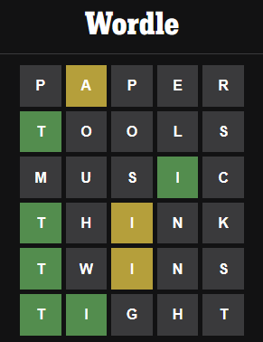
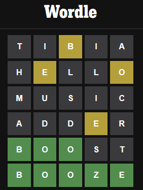

# How to Create a Wordle with TDD in Javascript
            


*We keep practicing this amazing Kata and learning. You can follow the steps!*

> TL;DR: Javascript is also awesome for TDD

During January 2022 Wordle rush, I wrote an article describing [how to create a Wordle with TDD using PHP](https://github.com/mcsee/Software-Design-Articles/tree/main/Articles/Wordle/How%20to%20Develop%20a%20Wordle%20Game%20using%20TDD%20in%2025%20Minutes/readme.md).

[How to Develop a Wordle Game using TDD in 25 Minutes](https://github.com/mcsee/Software-Design-Articles/tree/main/Articles/Wordle/How%20to%20Develop%20a%20Wordle%20Game%20using%20TDD%20in%2025%20Minutes/readme.md)

A few months after, I transcribed the UI version of a [Wordle created with Codex Artificial Intelligence](https://github.com/mcsee/Software-Design-Articles/tree/main/Articles/Wordle/Step%20by%20Step%20Wordle%20Creation%20With%20Codex%20AI/readme.md).

[Step by Step Wordle Creation With Codex AI](https://github.com/mcsee/Software-Design-Articles/tree/main/Articles/Wordle/Step%20by%20Step%20Wordle%20Creation%20With%20Codex%20AI/readme.md)

I will combine both worlds to program as a Centaur.

I will also compare the process and output from different language versions.

This is the Javascript version.

* * *

# Set-Up

As usual, we will focus on the game business logic, knowing we can build the user interface with [natural language commands](https://github.com/mcsee/Software-Design-Articles/tree/main/Articles/Wordle/Step%20by%20Step%20Wordle%20Creation%20With%20Codex%20AI/readme.md).

In this article, I will use a [repl.it](https://replit.com/@mcsee/Wordle-TDD) with [Jest](https://jestjs.io/).

Javascript has many Unit testing frameworks. 

You can use whatever you like.

Let's begin...

# Defining a Word

Following the same principles as [the previous article](https://github.com/mcsee/Software-Design-Articles/tree/main/Articles/Wordle/How%20to%20Develop%20a%20Wordle%20Game%20using%20TDD%20in%2025%20Minutes/readme.md), we will start by defining a Wordle Word.

The smallest information amount in Wordle is a word.

We can argue that *letter* is smaller, but all needed letter protocol is already defined (we might be wrong).

A word is not a *char(5)*.

A word is not an *array*.

A word is not a *string*. 

This is a common mistake and a [bijection violation](https://github.com/mcsee/Software-Design-Articles/tree/main/Articles/Theory/The%20One%20and%20Only%20Software%20Design%20Principle/readme.md).

A *word* and a *string* have different responsibilities, though they might intersect.

> Mixing (accidental) implementation details with ([essential](https://github.com/mcsee/Software-Design-Articles/tree/main/Articles/Theory/No%20Silver%20Bullet/readme.md)) behavior is a widespread mistake.

So we need to define *what is a word*.

A word in Wordle is a *valid* 5-letter word.

Let's start with our happy path:

[Gist Url]: # (https://gist.github.com/mcsee/ec82148f478ade72222ab31e8ea37a35)
```javascript
test("test01ValidWordLettersAreValid", async function() {
  const word = new Word('valid');
  expect(['v', 'a', 'l', 'i', 'd']).toStrictEqual(word.letters());
});
```

*We assert that prompting for letters in 'valid' returns an array of the letters.*

This is the result:

```
Message: letters from word must be 'valid'
Stack Trace:
ReferenceError: Word is not defined
    at Object.<anonymous> (/home/runner/Wordle-TDD/_test_runnertest_suite.js:6:18)
    at Promise.then.completed (/home/runner/Wordle-TDD/node_modules/jest-circus/build/utils.js:333:28)    
```

This is fine since we haven't defined what a word is.

## Notice

- This is a TDD Pattern. 
- We name the objects following their **behavior** even before they exist.
- *Word* class is not defined yet.
- Our Word's first trivial responsibility is to answer its letters.
- This is not a [getter](https://github.com/mcsee/Software-Design-Articles/tree/main/Articles/Code%20Smells/Code%20Smell%2068%20-%20Getters/readme.md). Every wordle word must answer its letters.
- We don't care about letter sorting. That would be a **premature optimization** and gold plating scenario.
- We start with a simple example. No duplicated.
- We don't mess with word validation yet (the word might be ZZZZZ).
- We can start with a simpler test validating the word is created. This would violate the test structure that always requires an assertion.
- The expected value should always be the first in the assertion.

# Creating a Word

We need to create a Word with the *letters()* function.

[Gist Url]: # (https://gist.github.com/mcsee/5c56be1b70bcd05c52a902db48aee85e)
```javascript
class Word {
  letters() {
    return ['v', 'a', 'l', 'i', 'd'];
  }  
}
```

## Notice

- We don't need constructors (yet).
- We hardcode letters function since this is the simplest possible solution up to now.
- Fake it till we make it.

We run all the tests (just 1) and we are OK.

```
✅  test01ValidWordLettersAreValid

  All tests have passed 1/1  
```

* * *

# Few Letters

Let's write another test:

[Gist Url]: # (https://gist.github.com/mcsee/4e366fed90874353fbc16e74aa8f3c82)
```javascript
test("test02FewWordLettersShouldRaiseException", async function() {
  expect(() => { 
    new Word('vali');                 
               }).toThrow(Error);
});
```

The test fails as expected...

```
❌  test02FewWordLettersShouldRaiseException
Stack Trace:
Error: expect(received).toThrow(expected)

Expected constructor: Error

Received function did not throw
    at Object.toThrow (/home/runner/Wordle-TDD/_test_runnertest_suite.js:10:23)

✅  test01ValidWordLettersAreValid

  1/2 passed, see errors above  
```

## Notice

- The first test passed
- The second test is expected to throw an exception. Which it didn't.
- We just declare a generic exception will be raised. 
- We just raise a generic Error. 
- Creating special exceptions is a [code smell](https://github.com/mcsee/Software-Design-Articles/tree/main/Articles/Code%20Smells/Code%20Smell%2026%20-%20Exceptions%20Polluting/readme.md) that pollutes namespaces. (unless we catch it, but this is not happening right now).

# Changing the current implementation

We need to change our implementation to make *test02* pass (and also *test01*).

[Gist Url]: # (https://gist.github.com/mcsee/c99a5093fcf300fee7c14c72c00d3a10)
```javascript
class Word {
  constructor(word) {
    if (word.length < 5)
      throw new Error('Too few letters. Should be 5');
  }
  letters() {
      return ['v', 'a', 'l', 'i', 'd'];
  }  
}
```

And the tests pass.

```

✅  test02FewWordLettersShouldRaiseException

✅  test01ValidWordLettersAreValid

  All tests have passed 2/2  
```

## Notice

- We are not using the constructor argument to set up the actual letters (yet).
- We just check for a few letters. Not for too many since we don't have yet a covering test.
- TDD requires full coverage. Adding another check without a test is a technique violation.

# Checking Too Many Letters

Let's check for too many.

[Gist Url]: # (https://gist.github.com/mcsee/872e0b7a24e76d743930c8b809d1201c)
```javascript
test("test03TooManyWordLettersShouldRaiseException", async function() {
  expect(() => { 
    new Word('toolong');                 
               }).toThrow(Error);

});
```

We run them:

```
❌  test03TooManyWordLettersShouldRaiseException
Stack Trace:
Error: expect(received).toThrow(expected)

Expected constructor: Error

Received function did not throw
    at Object.toThrow (/home/runner/Wordle-TDD/_test_runnertest_suite.js:10:23)

✅  test02FewWordLettersShouldRaiseException

✅  test01ValidWordLettersAreValid

  2/3 passed, see errors above  
```

We add the validation:

[Gist Url]: # (https://gist.github.com/mcsee/95c243fc74a36df850d626e6133ad527)
```javascript
class Word {
  constructor(letters) {
    if (letters.length < 5)
      throw new Error('Too few letters. Should be 5');
    if (letters.length > 5)
      throw new Error('Too many letters. Should be 5');
  }
  letters() {
      return ['v', 'a', 'l', 'i', 'd'];
  }  
}
```

And all tests passed.

```
All tests have passed 3/3  
```

* * *

# Refactor (or not)

We can now make an (optional) refactor and change the function to assert a range instead of two boundaries.
We decide to leave it this way since it is more declarative.

We can also add a test for zero words following the [Zombie methodology](https://github.com/mcsee/Software-Design-Articles/tree/main/Articles/TDD/How%20I%20Survived%20the%20Zombie%20Apocalypse/readme.md).

Let's do it.

[Gist Url]: # (https://gist.github.com/mcsee/ebe62e4ac40bc41d19fa1246c95e8cb4)
```javascript
test("test04EmptyLettersShouldRaiseException", async function() {
  expect(() => { 
    new Word('');                 
               }).toThrow(Error);

});
```

```
✅  test04EmptyLettersShouldRaiseException

✅  test03TooManyWordLettersShouldRaiseException

✅  test02FewWordLettersShouldRaiseException

✅  test01ValidWordLettersAreValid

```

It is no surprise the test passes since we already have a test covering this scenario.

As this test adds no value, we should remove it.

* * *

# Valid Letters

Let's check now what are valid letters:

[Gist Url]: # (https://gist.github.com/mcsee/1f839bedd5816e69d50f0e14ca282027)
```javascript
test("test05InvalidLettersShouldRaiseException", async function() {
   expect(() => { 
    new Word('vali*');                 
               }).toThrow(Error);

});
```

... and the test is broken since no assertion is raised.

```

❌  test05InvalidLettersShouldRaiseException
Stack Trace:
Error: expect(received).toThrow(expected)

Expected constructor: Error

Received function did not throw
```

We need to correct the code...

[Gist Url]: # (https://gist.github.com/mcsee/2060b50bb3a31ec9ae25a199deccb466)
```javascript
class Word {
  constructor(word) {
    if (word.length < 5)
      throw new Error('Too few letters. Should be 5');
    if (word.length > 5)
      throw new Error('Too many letters. Should be 5');
    if (word.indexOf('*') > -1) 
      throw new Error('Word has invalid letters');
  }
}
```

And all tests pass since we are clearly hardcoding.

```
All tests have passed 5/5  
```

## Notice

- We hardcode the asterisc to be the only invalid character (as far as we know).
- We can place the checking code *before* or *after* the previous validations.
-- Until we have an invalid case (with invalid characters and invalid length) we cannot assume the expected behavior.

# More Invalid

Let's add more invalid letters and correct the code.

[Gist Url]: # (https://gist.github.com/mcsee/461929411d2ecb441445df324ccb9a44)
```javascript
test("test06PointShouldRaiseException", async function() {
   expect(() => { 
    new Word('val.d');                 
               }).toThrow(Error);

});

// Solution

 constructor(word) {
    if (word.indexOf('*') > -1) 
      throw new Error('Word has invalid letters');
    if (word.indexOf('.') > -1) 
      throw new Error('Word has invalid letters');
}
```

## Notice

- We didn't write a more generic function (yet) since we cannot correct tests and refactor at the same time (the technique forbids us).

# Refactor

All the tests are ok. 

We can refactor.

We replace the last two sentences. 

[Gist Url]: # (https://gist.github.com/mcsee/9b973d0391ced4d805f25e904c7dabf6)
```javascript
class Word {
  constructor(word) {
    if (word.length < 5)
      throw new Error('Too few letters. Should be 5');
    if (word.length > 5)
      throw new Error('Too many letters. Should be 5');
    // Refactor  
    if (!word.match(/^[a-z]+$/i)) 
      throw new Error('word has invalid letters');
    //   
}
```

## Notice

- We can refactor only if we don't change the tests at the same time.
- The assertion checks only for uppercase letters. Since we are dealing with these examples up to now.
- We defer design decisions as much as possible.
- We defined a regular expression based on English Letters. We are pretty sure it won't accept Spanish (ñ), German(ë), etc.

As a checkpoint, we have only five letter words from now on.

Lets assert on *letters()* function. 

We left it hard coded.

TDD Opens many paths.

We need to keep track of all of them until we open new ones.

# Comparing Words

We need to compare words.

[Gist Url]: # (https://gist.github.com/mcsee/334da5849a12fcf84696c8023fd42c0e)
```javascript
test("test07TwoWordsAreNotTheSame", async function() {
    const firstWord = new Word('valid');
    const secondWord = new Word('happy');
    expect(firstWord).not.toStrictEqual(secondWord);
});

test("test08TwoWordsAreTheSame", async function() {
    const firstWord = new Word('valid');
    const secondWord = new Word('valid');
    expect(firstWord).toStrictEqual(secondWord);
});
```

And the test fails.

Let's use the parameter we are sending to them.

[Gist Url]: # (https://gist.github.com/mcsee/4e3858f55e112cbfa7440ebef43ad2e8)
```javascript
class Word {
  constructor(word) { 
    // ...
    this._word = word;
  }
  letters() {
      return ['v', 'a', 'l', 'i', 'd'];
  }  
}
```

```
✅  test08TwoWordsAreTheSame

✅  test07TwoWordsAreNotTheSame

✅  test06PointShouldRaiseException

✅  test05InvalidLettersShouldRaiseException

✅  test04EmptyLettersShouldRaiseException

✅  test03TooManyWordLettersShouldRaiseException

✅  test02FewWordLettersShouldRaiseException

✅  test01ValidWordLettersAreValid

  All tests have passed 8/8  
```

## Notice

- We store the letters and this is enough for object comparison (it might depend on the language).
- letters() function is still hardcoded

* * *

# More Words

We add a different word for letters comparison.

Remember *letters()* function was hardcoded until now.

[Gist Url]: # (https://gist.github.com/mcsee/fdd08a962d9b61b70cf4ffb740a904ac)
```javascript
test("test09LettersForGrassWord", async function() {
  const grassWord = new Word('grass'); 
  expect(['g','r','a','s','s']).toStrictEqual(grassWord.letters());
});
```

And the test fails as expected.

```
❌  test09LettersForGrassWord
Stack Trace:
Error: expect(received).toStrictEqual(expected) // deep equality

- Expected  - 4
+ Received  + 4

  Array [
-   "v",
+   "g",
+   "r",
    "a",
-   "l",
-   "i",
-   "d",
+   "s",
+   "s",
  ]
    at Object.toStrictEqual (/home/runner/Wordle-TDD/_test_runnertest_suite.js:9:37)
```

## Notice

- It is very important to check for equality/inequality instead of assertTrue() since many IDEs open a comparison tool based on the objects.

- This is another reason to use IDEs and never text editors.

Let's change the *letters()* function since we've been faking it.

[Gist Url]: # (https://gist.github.com/mcsee/a051bf0bb109627a0c6fa9c44e0a3502)
```javascript
class Word {
  letters() {
      return this._word.split("");
  }  
}
```

* * *

# Comparing different cases

We need to make sure comparisons are not case-sensitive.

[Gist Url]: # (https://gist.github.com/mcsee/7ab40f31bddbe67f1778d82393d6a4ca)
```javascript
test("test10ComparisonIsCaseInsensitve", async function() {
    const firstWord = new Word('valid');
    const secondWord = new Word('VALID');
    expect(firstWord).toStrictEqual(secondWord); 
});
```

Test fails.

We need to take a decision.

We decide all our domains will be lowercase.

We will not allow uppercase letters despite the UI having caps.

We won't do magic conversions.

We change the test to catch invalid uppercase letters and fix them.

[Gist Url]: # (https://gist.github.com/mcsee/7ac9a02b47895ae6f3bfbecfe842de8b)
```javascript
test("test10NoUppercaseAreAllowed", async function() {
   expect(() => { 
    new Word('vAliD');                 
               }).toThrow(Error);
});

class Word {
  constructor(word) {
    // We remove the /i modifier on the regular expression  
    if (!word.match(/^[a-z]+$/)) 
      throw new Error('word has invalid letters');   
  }
```

# English Dictionary

Our words are in a bijection with English Wordle words. or not?

Let's try a non-English word.

[Gist Url]: # (https://gist.github.com/mcsee/50ea04242702d5f40ce388624ec4414e)
```javascript
test("test11XXXXIsnotAValidWord", async function() {
  expect(() => { 
    new Word('XXXXX');                 
               }).toThrow(Error);
});
```

This test fails. 

We are not catching invalid English 5-letter words.

## Notice

- We need to make a decision. According to our [bijection](https://github.com/mcsee/Software-Design-Articles/tree/main/Articles/Theory/The%20One%20and%20Only%20Software%20Design%20Principle/readme.md), there's an external dictionary asserting valid words.

- We can validate with the dictionary upon word creation. But we want the dictionary to store valid wordle words. No strings.

- It is an egg-chicken problem.

- We decide to deal with invalid words in the dictionary and not the Wordle word.

- We remove the test. 

- We will find a better way in a few moments.

* * *

# Wordle Game

Let's create the game.

We start talking about a game that does not exist.

[Gist Url]: # (https://gist.github.com/mcsee/f4ab6a5f8ea7dd48e0b496867229ae34)
```javascript
test("test11EmptyGameHasNoWinner", async function() {
  const game = new Game()
  expect(false).toStrictEqual(game.hasWon());
});
```

Test fails.

We need to create the class and the function.

# Creating Game Objects

[Gist Url]: # (https://gist.github.com/mcsee/883f0afc47f66d6cbf0d5c19bbf82b56)
```javascript
class Game {
  hasWon() {
      return false;
  }  
}
```

* * *

# Words Attempted

We implement words attempted.

And the simplest solution.

Hardcoding as always.

[Gist Url]: # (https://gist.github.com/mcsee/150f2b229ead9940f6522edbf18438aa)
```javascript
test("test12EmptyGameWordsAttempted", async function() {
  const game = new Game()
  expect([]).toStrictEqual(game.wordsAttempted());
});

class Game {
  wordsAttempted() {
    return [];
  }
}
```

```

✅  test12EmptyGameWordsAttempted
...
  All tests have passed 12/12  
```

# Start guessing

[Gist Url]: # (https://gist.github.com/mcsee/123bfc2be3d3a605bf48aca0c09f311f)
```javascript
test("test13TryOneWordAndRecordIt", async function() {
  var game = new Game();
  game.addAttempt(new Word('loser'));
  expect([new Word('loser')]).toStrictEqual(game.wordsAttempted());   
});

class Game {
  constructor() {
    this._attempts = [];
  }
  hasWon() {
      return false;
  }
  wordsAttempted() {
    return this._attempts;
  }
  addAttempt(word) {
    this._attempts.push(word);    
  }
}
```

## Notice

- We store the attempts locally and add the attempt and also change wordsAttempted() real implementation.

* * *

# Has Lost

We can implement hasLost() if it misses 6 attempts.

With the simplest implementation as usual.

[Gist Url]: # (https://gist.github.com/mcsee/cd4f512f864df2a51c5f563a378de9a7)
```javascript
test("test14TryOneWordAndDontLooseYet", async function() {
  const game = new Game();
  game.addAttempt(new Word('loser'));
  expect(false).toStrictEqual(game.hasLost());   
});

class Game { 
  hasLost() {
      return false;
  }
}
```

## Notice

- We are learning the rules as our model grows.

# We lose the game

As always. We stop faking it and decide to make it.

[Gist Url]: # (https://gist.github.com/mcsee/91f61c07ac433e392490707413493c46)
```javascript
test("test15TryFiveWordsLoses", async function() {
  const game = new Game(
    [new Word('loser'),
    new Word('music')],
    new Word('music'));
  game.addAttempt(new Word('loser'));
  game.addAttempt(new Word('loser'));
  game.addAttempt(new Word('loser'));
  game.addAttempt(new Word('loser'));
  game.addAttempt(new Word('loser'));
  expect(false).toStrictEqual(game.hasLost());  
  // last attempt
  game.addAttempt(new Word('loser'));
  expect(true).toStrictEqual(game.hasLost());  
});

class Game {
  hasLost() {
    return this._attempts.length > 5;
  }
}
```

# We Play by the Dictionary

We have most of the mechanics.

Let's add valid words dictionary and play invalid.

[Gist Url]: # (https://gist.github.com/mcsee/9321c44468c5557a3564cd93cc1843fe)
```javascript
test("test16TryToPlayInvalid", async function() {
  const game = new Game([]);  
  expect(() => { 
    game.addAttempt(new Word('xxxxx'));            
               }).toThrow(Error);
});
```

The test fails as expected.

We fix it.

[Gist Url]: # (https://gist.github.com/mcsee/0b54f2baf740ef0ae7b9a371c04200ca)
```javascript
class Game {
  constructor(validWords) {
    this._attempts = [];
    this._validWords = validWords;
  }   
  addAttempt(word) {
    if (!this._validWords.some(validWord => validWord.sameAs(word))) {
      throw new Error(word.letters() + " is not a valid word");
    }
    this._attempts.push(word);    
  }
}

// fix previous tests
// change 

const game = new Game([]);

// to 

const game = new Game([new Word('loser')]);

Also add: 
Class Word {
 sameAs(word) {
    return word.word() == this.word();
  }
}
```

and the test is fixed, but...

```
  test16TryToPlayInvalid

❌  test15TryFiveWordsLoses
Stack Trace:
TypeError: Cannot read properties of undefined (reading 'includes')

❌  test14TryOneWordAndDontLooseYet
Stack Trace:
TypeError: Cannot read properties of undefined (reading 'includes') 

❌  test13TryOneWordAndRecordIt
Stack Trace:
TypeError: Cannot read properties of undefined (reading 'includes')

✅  test12EmptyGameWordsAttempted

✅  test10EmptyGameHasNoWinner

  12/15 passed, see errors above  
```

## Notice 

- test13, test14, and test15 were previously working.
- Now, they are broken since we added a new business rule.
- We need to pass the dictionary when creating the game.
- We fix the three of them by adding an array with the words we will use.
- It is a good sign our setup gets complex to keep creating valid scenarios.

# Play to Win

Now, we play to win.

We add the test and need to change hasWon() accordingly.

[Gist Url]: # (https://gist.github.com/mcsee/4569c8bfe5fa10531895f0ad3d447bc9)
```javascript
test("test17GuessesWord", async function() {
  const words = [new Word('happy')];
  const correctWord = new Word('happy');
  const game = new Game(words, correctWord);  
  expect(game.hasWon()).toStrictEqual(false);
  game.addAttempt(new Word('happy'));
  expect(game.hasWon()).toStrictEqual(true);
});

// we need to store the correct word
class Game {
  constructor(validWords, correctWord) {
    this._attempts = [];
    this._validWords = validWords;
    this._correctWord = correctWord;
  }
  hasWon() {
    return this._attempts.some(
      attempt => attempt.sameAs(this._correctWord)); 
}
```

## Notice

- We use no flags to check if someone has won. We can directly check it.
- We don't care if it has won in a previous attempt.
- We make an *addParameter* refactor with this new element to previous game definitions.

* * * 

# Correct Word

We added the *Correct Word*.

We need to assert this word is in the dictionary.

[Gist Url]: # (https://gist.github.com/mcsee/a919e191a875d0d3ff90b2df939aa70d)
```javascript
test("test18CorrectWordNotInDictionary", async function() {
  const words = [new Word('happy')];
  const correctWord = new Word('heros');  
   expect(() => { 
     new Game(words, correctWord);                 
               }).toThrow(Error);
});

class Game {
  constructor(validWords, correctWord) {
    if (!validWords.some(validWord => validWord.sameAs(correctWord)))
      throw new Error(
        "Correct word " + word.word() + " is not a valid word");  
  }
```

## Notice

- We needed to change all previous games since we needed to pass the winner game before the start
- This is a good side effect since it favors complete and immutable objects.

* * *

```
✅  test18CorrectWordNotInDictionary
...

✅  test01ValidWordLettersAreValid

  All tests have passed 17/17  

```

# Lost, Won, both?

What happens if we win in the final attempt?

Zombies ask us always to check for (B)boundaries where bugs hide.

[Gist Url]: # (https://gist.github.com/mcsee/c02c61e48fece9e40a0c29fde979b965)
```javascript
test("test19TryFiveWordsWins", async function() {
  const game = new Game(
    [new Word('loser'),
     new Word('heros')],
     new Word('heros'));
  game.addAttempt(new Word('loser'));
  game.addAttempt(new Word('loser'));
  game.addAttempt(new Word('loser'));
  game.addAttempt(new Word('loser'));
  game.addAttempt(new Word('loser'));
  expect(false).toStrictEqual(game.hasLost());  
  expect(false).toStrictEqual(game.hasWon());  
  // last attempt
  game.addAttempt(new Word('heros'));
  expect(false).toStrictEqual(game.hasLost());  
  expect(true).toStrictEqual(game.hasWon());  
});

// And the correction

hasLost() {
    return !this.hasWon() && this._attempts.length > 5;
  }
```

* * *

We have all the mechanics.

# Letter Positions

Let's add the letter's positions.

We can do it in Word class.

[Gist Url]: # (https://gist.github.com/mcsee/07e861eebc069ca0a39810d86a1256c8)
```javascript
test("test20LettersDoNotMatch", async function() {
  const firstWord = new Word('trees');
  const secondWord = new Word('valid');
  expect([]).toStrictEqual(firstWord.matchesPositionWith(secondWord));
});
```

As usual, we get an *undefined function* error:

```
❌  test20LettersDoNotMatch
Stack Trace:
TypeError: firstWord.matchesPositionWith is not a function

```

Let's fake it as usual.

[Gist Url]: # (https://gist.github.com/mcsee/72e0ee60c96c78e9685fe4cc7663f3cf)
```javascript
class Word {
  matchesPositionWith(correctWord) {
    return [];    
  }
}
```

## Notice

- Names are always very important.
- We can name the parameter *anotherWord*.
- We prefer *correctWord*.
- We are aware we will soon need a complicated algorithm and roles should be clear and contextual. 

* * *

# Match

Let's match

[Gist Url]: # (https://gist.github.com/mcsee/5ff25365ed85eba5695f181e1ed68130)
```javascript
test("test21MatchesFirstLetter", async function() {
  const guessWord = new Word('trees');
  const correctWord = new Word('table');
  expect([1]).toStrictEqual(guessWord.matchesPositionWith(correctWord));
});
```

Fails.

We need to define it better

This is a good enough algorithm. 

Ugly and imperative

We will refactor it later, for sure.

[Gist Url]: # (https://gist.github.com/mcsee/caddd5b89927478e10ea23df58dd01b5)
```javascript
matchesPositionWith(correctWord) {
   var positions = [];
   for (var currentPosition = 0; 
      currentPosition < this.letters().length; 
      currentPosition++) {
       if (this.letters()[currentPosition] == 
           correctWord.letters()[currentPosition]) {
             positions.push(currentPosition + 1); 
             // Humans start counting on 1
       }
   }
   return positions;
}
```

And all the tests pass.

## Notice

- The matching property is not symmetric

* * *

# Incorrect Positions

Now we need the final steps. 

Matching in incorrect positions.

and always the simplest solution...

[Gist Url]: # (https://gist.github.com/mcsee/499d7e27102345b91ab1a1835d6a62bb)
```javascript
test("test23MatchesIncorrectPositions", async function() {
  const guessWord = new Word('trees');
  const correctWord = new Word('drama');
  expect([2]).toStrictEqual(
    guessWord.matchesPositionWith(correctWord));
  expect([]).toStrictEqual(
    guessWord.matchesIncorrectPositionWith(correctWord));
});

// The simplest solution

class Word {
  matchesIncorrectPositionWith(correctWord) {
     return [];
  }
}
```

## Notice

- By adding these safe, zero cases we miss many usual bugs.

A more spicy test case.

[Gist Url]: # (https://gist.github.com/mcsee/4b8be148dc13e3ded3723c315d22cc17)
```javascript
test("test24MatchesIncorrectPositionsWithMatch", async function() {
  const guessWord = new Word('alarm');
  const correctWord = new Word('drama');
  expect([3]).toStrictEqual(
    guessWord.matchesPositionWith(correctWord));
  expect([1, 4, 5]).toStrictEqual(
    guessWord.matchesIncorrectPositionWith(correctWord));
  // A*ARM vs *RAMA
  expect([3]).toStrictEqual(
    correctWord.matchesPositionWith(guessWord));
  expect([2, 4, 5]).toStrictEqual(
    correctWord.matchesIncorrectPositionWith(guessWord));
});
```

Let's go for the implementation

[Gist Url]: # (https://gist.github.com/mcsee/84d386ea6218a4bc0f1ad0a121668da3)
```javascript
class Word {
  matchesIncorrectPositionWith(correctWord) {
      var positions = [];
      for (var currentPosition = 0;
           currentPosition < 5; 
           currentPosition++) {
        if (correctWord.letters().
            includes(this.letters()[currentPosition])) {
             positions.push(currentPosition + 1);
        }
      }
      return positions.filter(function(position) {
        return !this.matchesPositionWith(correctWord).
         includes(position);
     }.bind(this));
    }
  }
}
```

That's it.

We have implemented a very small model with all meaningful rules.

```
All tests have passed 21/21  
```

# Playing with real examples

[Gist Url]: # (https://gist.github.com/mcsee/fe5f2933602519ba102b99cc4dd3b37a)
```javascript
test("test20220911", async function() {
  const correctWord = new Word('tibia');
    // Sorry for the spoiler
  const words = [
    // all the words I've tried
    new Word('paper'), 
    new Word('tools'),
    new Word('music'),
    new Word('think'), 
    new Word('twins'),
    new Word('tight'),
    // plus the winning word
    correctWord
  ];
  
  const game = new Game(words, correctWord);  
  expect(game.hasWon()).toStrictEqual(false);
  expect(game.hasLost()).toStrictEqual(false);
  // P(A)PER vs TIBIA
  game.addAttempt(new Word('paper'));
  expect([]).toStrictEqual((new Word('paper')).
                           matchesPositionWith(correctWord));
  expect([2]).toStrictEqual((new Word('paper')).
                            matchesIncorrectPositionWith(correctWord));
  // [T]OOLS vs TIBIA
  expect([1]).toStrictEqual((new Word('tools'))
                            .matchesPositionWith(correctWord));
  expect([]).toStrictEqual((new Word('tools'))
                           .matchesIncorrectPositionWith(correctWord));  
  game.addAttempt(new Word('tools'));
  // MUS[I]C vs TIBIA
  expect([4]).toStrictEqual((new Word('music')).
                            matchesPositionWith(correctWord));
  expect([]).toStrictEqual((new Word('music')).
                           matchesIncorrectPositionWith(correctWord));
  game.addAttempt(new Word('music'));
  // [T]H(I)NK vs TIBIA
  expect([1]).toStrictEqual((new Word('think')).
                            matchesPositionWith(correctWord));
  expect([3]).toStrictEqual((new Word('think')).
                            matchesIncorrectPositionWith(correctWord));
  game.addAttempt(new Word('think'));
  // [T]W(I)NS vs TIBIA
  expect([1]).toStrictEqual((new Word('twins')).
                            matchesPositionWith(correctWord));
  expect([3]).toStrictEqual((new Word('twins')).
                            matchesIncorrectPositionWith(correctWord));  
  game.addAttempt(new Word('twins'));  
  expect(game.hasWon()).toStrictEqual(false);
  expect(game.hasLost()).toStrictEqual(false);
  // [T][I]GHT vs TIBIA
  expect([1, 2]).toStrictEqual((new Word('tight')).
                               matchesPositionWith(correctWord));
  expect([]).toStrictEqual((new Word('tight')).
                           matchesIncorrectPositionWith(correctWord));  
  
  game.addAttempt(new Word('tight'));
  expect(game.hasWon()).toStrictEqual(false);
  expect(game.hasLost()).toStrictEqual(true);
});
```




(You will find more daily examples in the repo)

# Playing by the complex rules

I was very happy with my working wordle.

Then I read about [its complex rules](https://jonahlawrence.hashnode.dev/why-most-wordle-clones-are-wrong)

Learning new rules is not a problem when we have [TDD](https://github.com/mcsee/Software-Design-Articles/tree/main/Articles/TDD%20Conference%202021/TDD%20Conference%202021%20-%20All%20Talks/readme.md).

Let's cover the examples from the article

[Gist Url]: # (https://gist.github.com/mcsee/af352a39b07ef05a02a668b3d514ca05)
```javascript
test("test25VeryComplexWrongPositions", async function() {

  const guessWord = new Word('geese');
  const correctWord = new Word('those');
  expect([4, 5]).toStrictEqual(guessWord.
                       matchesPositionWith(correctWord));
  expect(['s','e']).toStrictEqual(guessWord.
                       lettersAtCorrectPosition(correctWord));
  expect([]).toStrictEqual(guessWord.
                       lettersAtWrongtPosition(correctWord));
  expect([]).toStrictEqual(guessWord.
                       matchesIncorrectPositionWith(correctWord));
  // GEE[S][E] vs THOSE

  const anotherGuessWord = new Word('added');
  const anotherCorrectWord = new Word('dread');
  expect([5]).toStrictEqual(anotherGuessWord.
                       matchesPositionWith(anotherCorrectWord));
  expect(['d']).toStrictEqual(anotherGuessWord.
                       lettersAtCorrectPosition(anotherCorrectWord));
  expect(['a', 'd', 'e']).toStrictEqual(anotherGuessWord.
                       lettersAtWrongtPosition(anotherCorrectWord));
  expect([1, 2, 4]).toStrictEqual(anotherGuessWord.
                       matchesIncorrectPositionWith(anotherCorrectWord));
  // (A)(D)D(E)[D] vs DREAD
  
  const yetAnotherGuessWord = new Word('mamma');
  const yetAnotherCorrectWord = new Word('maxim');
  expect([1, 2]).toStrictEqual(yetAnotherGuessWord.
                       matchesPositionWith(yetAnotherCorrectWord));
  expect(['m', 'a']).toStrictEqual(yetAnotherGuessWord.
                       lettersInCorrectPosition(yetAnotherCorrectWord));
  expect(['m']).toStrictEqual(yetAnotherGuessWord.
                       lettersAtWrongtPosition(yetAnotherCorrectWord));
  expect([3]).toStrictEqual(yetAnotherGuessWord.
                       matchesIncorrectPositionWith(yetAnotherCorrectWord));
  // [M][A](M)MA vs MAXIM
});
```

Let's steal the algorithm from the article.

[Gist Url]: # (https://gist.github.com/mcsee/fb0447b21f640167a08170a82cd237e1)
```javascript
matchesIncorrectPositionWith(correctWord) {     
    const correctPositions = this.matchesPositionWith(correctWord);
    var incorrectPositions = [];
    var correctWordLetters = correctWord.letters();
    var ownWordLetters = this.letters();
    for (var currentPosition = 0; currentPosition < 5; currentPosition++) {
      if (correctPositions.includes(currentPosition + 1)) {
        // You can use these wildcards since they are no valid letters
        correctWordLetters.splice(currentPosition, 1, '*');
        ownWordLetters.splice(currentPosition, 1, '+');
      }
    }    
    for (var currentPosition = 0; currentPosition < 5; currentPosition++) {
      const positionInCorrectWord = correctWordLetters.
      indexOf(ownWordLetters[currentPosition]);
      if (positionInCorrectWord != -1) {        
        correctWordLetters.splice(positionInCorrectWord, 1, '*');
        ownWordLetters.splice(currentPosition, 1, '+');
        incorrectPositions.push(currentPosition + 1); 
      }
    }    
    return incorrectPositions;
  }
```

We need to add another function (which will be useful for keyboard colors).

[Gist Url]: # (https://gist.github.com/mcsee/a6f6822743d9e982f7d8ec39f6335a9f)
```javascript
lettersAtCorrectPosition(correctWord) {
    return this.matchesPositionWith(correctWord).
        map(position => this.letters()[position -1 ]);
}
  
lettersAtWrongtPosition(correctWord) {
    return this.matchesIncorrectPositionWith(correctWord).
        map(position => this.letters()[position -1]);
}
```

## Notice

- The algorithm changes a copy of the correct word by placing '*' when the correct position matches
- It also hides the visited letters by changing to a special (an invalid '+').

```
DREAD vs ADDED
DREA* vs ADDE+
DRE** vs +DDE+
*RE** vs ++DE+
*R*** vs ++D++
```

# Conclusions

This solution is different and more complete than the [previous one](https://github.com/mcsee/Software-Design-Articles/tree/main/Articles/Wordle/How%20to%20Develop%20a%20Wordle%20Game%20using%20TDD%20in%2025%20Minutes/readme.md).

The wordle rules have not changed.

According to David Farley, we need to be experts at learning.

And we learn by practicing katas like this one.

We end up with 2 compact classes where we defined our business model.

This small model has a real 1:1 bijection in the [MAPPER](https://github.com/mcsee/Software-Design-Articles/tree/main/Articles/Theory/What%20is%20(wrong%20with)%20software/readme.md) to the real-world.

It is ready to evolve.

This game is a metaphor for real software engineering.

Hope you find it interesting and follow the kata with me.

# Try it out!

You can play around with the working [repl.it](https://replit.com/@mcsee/Wordle-TDD).

# Next Steps

- Combine this solution with the AI-Generated

- Use a real dictionary

- Change the language and alphabet

- Change the rules to a different wordle