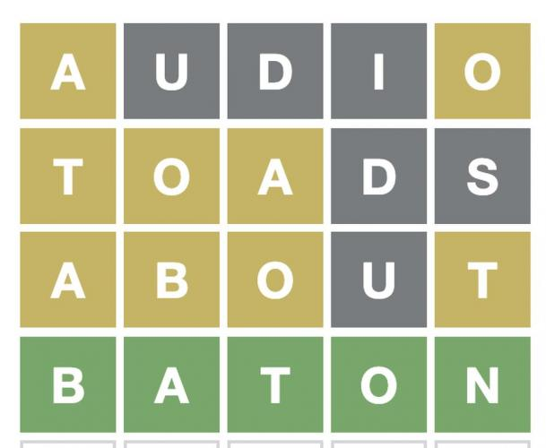

# How to Develop a Wordle Game using TDD in 25 Minutes



Everybody is playing Wordle these days...

And I love [TDD](TDD Conference 2021\TDD Conference 2021 - All Talks).

So, let's get moving...

> TL;DR: With just a few steps we can build a robust Wordle.

# Defining a word

The minimum information amount in Wordle is a word.

We can argue that *letter* is smaller, but we think all needed letter protocol is already defined (we might be wrong).

A word is not a string. This is a common mistake and a [bijection violation](Theory\The One and Only Software Design Principle).

A *word* and a *string* have different responsibilities, though they might intersect.

> Mixing (accidental) implementation details with (essential) behavior is a very common mistake.

So we need to define *what is a word*.

A word in Wordle is a *valid* 5 letter word.

Let's start with our happy path:

[Gist Url]: # (https://gist.github.com/mcsee/9cc79371d1420e3349049abf1a9464ed)
```php
<?php

namespace Wordle;

use PHPUnit\Framework\TestCase;

final class WordTest extends TestCase {
    public function test01ValidWordLettersAreValid() {
        $wordleWord = new Word('valid');
        $this->assertEquals(['v', 'a', 'l', 'i', 'd'], $wordleWord->letters());
    }
}
```

*We assert that prompting for letters in 'valid' returns an array with the letters.*

## Notice

- Word class is not defined yet.
- We don't care about letter sorting. That would be a premature optimization and gold plating scenario.
- We start with a simple example. No duplicated.
- We don't mess with word validation yet (word might be XXXXX).
- We can start with a simpler test just validation word is created. This would violate the test structure that always requires an assertion.
- Expected value should always be first.

We get an error:

> Error : Class "Wordle\Word" not found

This is good in TDD, We are exploring our domain.

We need to create a Word with the constructor and the letters() function.

[Gist Url]: # (https://gist.github.com/mcsee/27a551a004684b0fe4fbc6c6f42f00b5)
```php
<?php

Namespace Wordle;

final class Word {

    function __construct(string $letters) {
    }

    function letters(): array {
        return ['v', 'a', 'l', 'i', 'd'];
    }
}
```

## Notice

- We don't need anything to do with the constructor parameter.
- We hardcode letters function since this is the simplest possible solution up to now.
-- Fake it till we make it.
- Classes are final to avoid subclassification.

We run all the tests (just 1) and we are OK.

> OK (1 test, 1 assertion)

* * *

Let's write another test:

[Gist Url]: # (https://gist.github.com/mcsee/d1f75826b3af3e4aa604c8a00583aa57)
```php
<?php 

  public function test02FewWordLettersShouldRaiseException() {
        $this->expectException(\Exception::class);
        new Word('vali');
  }
```

## Notice

- PHPUnit exception raising is not very good. We just declare an exception will be raised.

Test fails...

> Failed asserting that exception of type "Wordle\Exception" is thrown.

We need to change our implementation in order to make test02 pass (and also test01)

[Gist Url]: # (https://gist.github.com/mcsee/d1f75826b3af3e4aa604c8a00583aa57)
```php
<?php 

  public function test02FewWordLettersShouldRaiseException() {
        $this->expectException(\Exception::class);
        new Word('vali');
  }
```

## Notice

- We just check for few letters. Not for too many since we don't have yet a covering test.
- TDD requires full coverage. Adding another check without a test is a technique violation.
- We just raise a generic Exception. Creating special exceptions is a [code smell](Code Smells\Code Smell 26 - Exceptions Polluting) that pollutes namespaces. (unless we catch it, but this is not happening right now).

Let's check for too many

[Gist Url]: # (https://gist.github.com/mcsee/a2eb5e96564672848186a5f79b6830d6)
```php
<?php 
  public function test03TooManyWordLettersShouldRaiseException() {
        $this->expectException(\Exception::class);
        new Word('toolong');
  }
```

Test fails as expected. Let's correct it.

> Failed asserting that exception of type "Exception" is thrown.

[Gist Url]: # (https://gist.github.com/mcsee/b63a3e11b0e5169aa03bea2426e451b6)
```php
<?php

function __construct(string $letters) {
        if (strlen($letters) < 5)
            throw new \Exception('Too few letters. Should be 5');
        if (strlen($letters) > 5)
            throw new \Exception('Too many letters. Should be 5');
}
```

And all tests passed.

> OK (3 tests, 3 assertions)

* * *

We can now make an (optional) refactor and change the function to assert for a range instead of two boundaries.
We decide to leave this way since it is more declarative.

We can also add a test checking for zero letters following [Zombie methodology](TDD\How I Survived the Zombie Apocalypse).
Let's do it.

[Gist Url]: # (https://gist.github.com/mcsee/3a55bc89bb13afcda0b6f9657a1bb7f1)
```php
<?php

  public function test04EmptyLettersShouldRaiseException() {
        $this->expectException(\Exception::class);
        $wordleWord = new Word('');
  }
```

it is no surprise test passes since we already have a test covering this scenario.
As this test adds no value we should remove it.

* * *

Let's check now what is a valid letter:

[Gist Url]: # (https://gist.github.com/mcsee/b005c8411df5b8bb594b6e4f471e0a68)
```php
<?php

  public function test05InvalidLettersShouldRaiseException() {
        $this->expectException(\Exception::class);
        $wordleWord = new Word('vali*');
  }
```

... and test is broken since no assertion is raised.

> Failed asserting that exception of type "Exception" is thrown.

We need to correct the code...

[Gist Url]: # (https://gist.github.com/mcsee/84547c8fb6eae1ef1ef0640100370861)
```php
<?php

  function __construct(string $letters) {
       if (str_contains($letters,'*')) {
          throw new \Exception('word contain invalid letters');
  }
```

And all tests pass since we are clearly hardcoding.

> OK (5 tests, 5 assertions)

* * *

Let's add more invalid letters and correct the code.

[Gist Url]: # (https://gist.github.com/mcsee/a487ce7640e5f08371d85ef4744faad1)
```php
<?php

  public function test06PointShouldRaiseException() {
        $this->expectException(\Exception::class);
        $wordleWord = new Word('v.lid');
  }

  // Solution

  function __construct(string $letters) {
        if (str_contains($letters, '.'))
            throw new \Exception('word contain invalid letters');
    // ....
  } 
  

```

## Notice

- We didn't write a more generic function (yet) since we cannot correct tests and refactor at the same time (the technique forbids us).

All tests are ok. 

We can refactor.

We replace the last two sentences 

[Gist Url]: # (https://gist.github.com/mcsee/2b61b49a58467ab7891f3a52cb30aea7)
```php
<?php

  function __construct(string $letters) {
        if (!\preg_match('/^[a-z]+$/i', $letters)) {
            throw new \Exception('word contain invalid letters');
      }
    // ..
```

## Notice

- The assertion checks only for uppercase letters. Since we are dealing with these examples up to now.
- We defer design decisions as much as possible.
- We defined a regular expression based on English Letters. We are pretty sure it won't accept Spanish (ñ), German(ë), etc.

As a checkpoint, we have only five letters words from now on.

Lets assert on letters() function. 
We left it hardcoded.
TDD Opens many paths.
We need to keep track of all of them until we open new ones.

We need to compare words

[Gist Url]: # (https://gist.github.com/mcsee/436ca92754ab7ebe837d81a210bde1a5)
```php
<?php  

  public function test07TwoWordsAreNotTheSame() {
        $firstWord = new Word('valid');
        $secondWord = new Word('happy');
        $this->assertNotEquals($firstWord, $secondWord);
  }

  public function test08TwoWordsAreTheSame() {
        $firstWord = new Word('valid');
        $secondWord = new Word('valid');
        $this->assertEquals($firstWord, $secondWord);
    }
```

And test fails.
Let's use the parameter we are sending to them.

[Gist Url]: # (https://gist.github.com/mcsee/5e8bff65fe1f8ae0e375ad23de9e6fbf)
```php
<?php

final class Word {

    private $letters;
    function __construct(string $letters) {
        if (!\preg_match('/^[a-z]+$/i', $letters)) {
            throw new \Exception('word contain invalid letters');
        }
        if (strlen($letters) < 5) {
            throw new \Exception('Too few letters. Should be 5');
        }
        if (strlen($letters) > 5) {
            throw new \Exception('Too many letters. Should be 5');
        }
        $this->letters = $letters;
    }

    function letters(): array {
        return ['v', 'a', 'l', 'i', 'd'];
    }
}
```

## Notice

- We store the letters and this is enough for objects comparison (it might depend on the language).
- letters() function is still hardcoded

Tests are OK

> OK (8 tests, 8 assertions)

* * *

We add a different word for letters comparison

[Gist Url]: # (https://gist.github.com/mcsee/0b837b676c8878c55089d85d3379c57c)
```php
<?php

public function test09LettersForGrassWord() {
        $grassWord = new Word('grass');
        $this->assertEquals(['g', 'r', 'a', 's', 's'], $grassWord->letters());
    }
```

And test fails.

> Failed asserting that two arrays are equal.

It is very important to check for equality/inequality instead of assertTrue() since many IDEs open a comparison tool based on the objects.
This is another reason to use IDEs and never text editors.

Let's change the letters() function

[Gist Url]: # (https://gist.github.com/mcsee/4926897d2d889d9a8b5199d678b8f2d7)
```php
<?php 

  function letters(): array {
        return str_split($this->letters);
  }
```

* * *

Our words are in a bijection with English Wordle words. or not?

[Gist Url]: # (https://gist.github.com/mcsee/51f9ea83237ec195e4404297af50ef27)
```php
<?php

  public function test10XXXXIsnotAValidWord() {
        $this->expectException(\Exception::class);
        $wordleWord = new Word('xxxxx');
  }
```

This test fails. 
We are not catching invalid English 5 letter words.

We need to make a decision. According to our bijection, there's an external dictionary asserting for valid words.

We can validate with the dictionary upon word creation. But we want the dictionary to store valid worlde words. Not strings.

It is an egg-chicken problem.

We decide to deal with invalid words in the dictionary and not the Wordle word.

* * * 

We create new tests on our dictionary.

[Gist Url]: # (https://gist.github.com/mcsee/89e112072e327b899385545c1158ed07)
```php
<?php

namespace Wordle;

use PHPUnit\Framework\TestCase;

final class DictionaryTest extends TestCase {
    public function test01EmptyDictionaryHasNoWords() {
        $dictionary = new Dictionary([]);
        $this->assertEquals(0, $dictionary->wordsCount());
    }
}
```

Test fails since we have not defined our Dictionary.
We do it:

[Gist Url]: # (https://gist.github.com/mcsee/d519db05334e7d1bc5b6c06214a90127)
```php
<?php

Namespace Wordle;

final class Dictionary {

    function __construct(array $words) {
        $this->words = $words;
    }

    function wordsCount(): int {
        return 0;
    }
}

```

## Notice

- We don't do anything with the words yet.
- We hardcode the number of words.
- We faked it yet again.

* * *

We add another case for count 1 if the dictionary has one word.

[Gist Url]: # (https://gist.github.com/mcsee/3ea823759ea16537443da0c0cb31b6fd)
```php
<?php
  public function test02SingleDictionaryReturns1AsCount() {
        $words = [new Word('happy')];
        $dictionary = new Dictionary($words);
        $this->assertEquals(1, $dictionary->wordsCount());
   }
```

Test fails as expected

> Failed asserting that 0 matches expected 1.

We correct it.

[Gist Url]: # (https://gist.github.com/mcsee/2a91ea82411556436d6bb0782f973d3b)
```php
<?php

final class Dictionary {

    private $words;
    function __construct(array $words) {
        $this->words = $words;
    }

    function wordsCount(): int {
        return count($this->words);
    }
}
```

## Notice
- Dictionary is immutable
- No Setters or getters

* * *

We start with inclusion and get an error.
> Error : Call to undefined method Wordle\Dictionary::includesWord()

So we fake it.

[Gist Url]: # (https://gist.github.com/mcsee/a0fa8bc8e712c955d49e95884e3087c7)
```php
<?php
public function test03DictionaryDoesNotIncludeWord() {
        $words = [new Word('happy')];
        $dictionary = new Dictionary($words);
        $this->assertFalse($dictionary->includesWord(new Word('sadly')));
    }

 
// the solution
function includesWord(): bool {
        return false;
    }

```

* * *

We add a positive case.
And we need to correct the function instead of hardcoding it.

[Gist Url]: # (https://gist.github.com/mcsee/a2cc5ab3c924753b75658c1f6d9dacbe)
```php
<?php 

public function test04DictionaryIncludesWord() {
        $words = [new Word('happy')];
        $dictionary = new Dictionary($words);
        $this->assertTrue($dictionary->includesWord(new Word('happy')));
    }

function includesWord(Word $subjectToSearch): bool {
        return in_array($subjectToSearch, $this->words);
    }
```
 
* * *

We have the dictionary working.

Let's create the game.

[Gist Url]: # (https://gist.github.com/mcsee/265aaab5418bfcd9119b734d46496765)
```php
<?php

final class GameTest extends TestCase {
    public function test01EmptyGameHasNoWinner() {
        $game = new Game();
        $this->assertFalse($game->hasWon());
    }
}
```

Test fails.
We need to create the class and the function.

[Gist Url]: # (https://gist.github.com/mcsee/a20f8b6c18acc9bfd6e4eab7a728e725)
```php
<?php

Namespace Wordle;

final class Game {

    function __construct() {
    }

    function hasWon(): bool{
        return false;
    }

}
```

* * *

We implement words tried.
And the simplest solution

[Gist Url]: # (https://gist.github.com/mcsee/8f7c41868e57db720d906c21f4ceaafc)
```php
<?php

public function test02EmptyGameHasNoWordsTried() {
        $game = new Game();
        $this->assertEquals([], $game->wordsTried());
    }

// and the model

function wordsTried(): array {
        return [];
    }

```

* * *

Let's try some words.
We get
> Error : Call to undefined method Wordle\Game::addTry()

We define it.

[Gist Url]: # (https://gist.github.com/mcsee/28755b1c817fedca782670fdf2854d9d)
```php
<?php

public function test03TryOneWordAndRecordIt() {
        $game = new Game();
        $game->addtry(new Word('loser'));
        $this->assertEquals([new Word('loser')], $game->wordsTried());
    }

// The solution

final class Game {

    private $wordsTried;
    function __construct() {
        $this->wordsTried = [];
    }

    function addTry(Word $trial) {
        return $this->wordsTried[] = $trial;
    }

    function wordsTried(): array {
        return $this->wordsTried;
    }
}
```

## Notice

- We store the trials locally and add the trial and also change wordsTried() real implementation.

* * *

We can implement hasLost() if it misses 5 trials.
With the simplest implementation as usual.

[Gist Url]: # (https://gist.github.com/mcsee/7950f4d03cd5895e8e6dba93ada95ff9)
```php
<?php

public function test04TryOneWordAndDontLooseYet() {
        $game = new Game();
        $game->addtry(new Word('loser'));
        $this->assertFalse($game->hasLost());
    }

// the solution
 function hasLost(): bool {
        return false;
    }


```

* * *

As always. Me stop faking it and decide to make it.

> Failed asserting that false is true.

So we change it as below.

[Gist Url]: # (https://gist.github.com/mcsee/0f7168637dc6ee0026d3279ca394a9d0)
```php
<?php
  public function test05TryFiveWordsLoses() {
        $game = new Game();
        $game->addtry(new Word('loser'));
        $game->addtry(new Word('loser'));
        $game->addtry(new Word('loser'));
        $game->addtry(new Word('loser'));
        $this->assertFalse($game->hasLost());
        $game->addtry(new Word('loser'));
        $this->assertTrue($game->hasLost());
    }
'''

// The code
function hasLost(): bool {
        return count($this->wordsTried) > 4;
    }

```

* * *

We have most of the mechanics.
Let's add the dictionary and play invalid.

[Gist Url]: # (https://gist.github.com/mcsee/32510fc2f108ab46ec8f45d2880fa7ad)
```php
<?php

    public function test06TryToPlayInvalid() {
        $words = [new Word('happy')];
        $dictionary = new Dictionary($words);
        $game = new Game($dictionary);
        $this->expectException(\Exception::class);
        $game->addtry(new Word('xxxxx'));
    }
```

We need to pass the dictionary to fix the tests

[Gist Url]: # (https://gist.github.com/mcsee/41bcbba794e9749a4ef425cbcc19df39)
```php
<?php

final class Game {

    private $wordsTried;
    private $dictionary;
    function __construct(Dictionary $validWords) {
        $this->dictionary = $validWords;
        $this->wordsTried = [];
    }

    function addTry(Word $trial) {
        if (!$this->dictionary->includesWord($trial)) {
            throw new \Exception('Word is not included ' . $trial);
        }
        return $this->wordsTried[] = $trial;
    }
}
```

Fixed.

* * *

Now, we play to win

[Gist Url]: # (https://gist.github.com/mcsee/4a09c3f7408dc346ca140730c29613d9)
```php
<?php
  public function test07GuessesWord() {
        $words = [new Word('happy')];
        $dictionary = new Dictionary($words);
        $winnerWord = new Word('happy');
        $game = new Game($dictionary, $winnerWord);
        $this->assertFalse($game->hasWon());
        $game->addtry(new Word('happy'));
        $this->assertTrue($game->hasWon());
    }
```

We need to correct *hasWon()*.

[Gist Url]: # (https://gist.github.com/mcsee/3377bd5d2fb3945c0c8279cc3a9a8c5b)
```php
<?php

  private $winnerWord;
    function __construct(Dictionary $validWords, Word $winnerWord) {
        $this->dictionary = $validWords;
        $this->wordsTried = [];
        $this->winnerWord = $winnerWord;
    }

    function hasWon(): bool {
        return in_array($this->winnerWord, $this->wordsTried);
    }
```

## Notice

- We use no flags to check if someone has won. We can directly check it.
- We make an *addParameter* refactor with this new element to previous game definitions.

* * * 

We added winnerWord.
We need to assert this word is in the dictionary.

[Gist Url]: # (https://gist.github.com/mcsee/873ead85a53210b6dcb7e5f62fbb9bc0)
```php
<?php 
 public function test08WinnerWordNotInDictionary() {
        $words = [new Word('happy')];
        $dictionary = new Dictionary($words);
        $winnerWord = new Word('heros');
        $this->expectException(\Exception::class);
        $game = new Game($dictionary, $winnerWord);
    }
 
// and add the check...

function __construct(Dictionary $validWords, Word $winnerWord) {
        if (!$validWords->includesWord($winnerWord)) {
            throw new \Exception('Winner word must be in dictionary');
        }

```

> OK (8 tests, 10 assertions)

* * *

We have all the mechanics.

Let's add the letter's positions.
We can do it in Word class.

[Gist Url]: # (https://gist.github.com/mcsee/99f8f99d498c22d7aed43cbfdc13099a)
```php
<?php
public function test10NoMatch() {
        $firstWord = new Word('trees');
        $secondWord = new Word('valid');
        $this->assertEquals([], $firstWord->matchesPositionWith($secondWord));
    }


// This method in Word class

 function matchesPositionWith(Word $anotherWord) : array {
        return [];
    }
```

Test passes
>OK (10 tests, 10 assertions)

* * *

Let's match

[Gist Url]: # (https://gist.github.com/mcsee/d51f189388a1e5b0677e25d441db5d42)
```php
<?php
  public function test11MatchesFirstLetter() {
        $firstWord = new Word('trees');
        $secondWord = new Word('table');
        $this->assertEquals([1], $firstWord->matchesPositionWith($secondWord));
    }
```

Fails.

We need to define it better
 
[Gist Url]: # (https://gist.github.com/mcsee/a1459794c3446229ac515520caa36250)
```php
<?php
function matchesPositionWith(Word $anotherWord) : array {
        $positions = [];
        for ($currentPosition = 0; $currentPosition < count($this->letters()); $currentPosition++) {
            if ($this->letters()[$currentPosition] == $anotherWord->letters()[$currentPosition]) {
                $positions[] = $currentPosition + 1; // Humans start counting on 1
                // We can implement this better in several other languages
            }
        }
        return $positions;
    }

```

We keep running all the test all the time

> OK (23 tests, 25 assertions)

* * *

We can add a safety test to be more declarative

[Gist Url]: # (https://gist.github.com/mcsee/e34fbb77a1fe9f4249f0f27f6ed9743f)
```php
<?php

public function test12MatchesAllLetters() {
        $firstWord = new Word('trees');
        $secondWord = new Word('trees');
        $this->assertEquals([1, 2, 3 , 4 ,5], $firstWord->matchesPositionWith($secondWord));
    }
```

Now we need the final steps. Matching in incorrect positions.
and always the simplest solution...

[Gist Url]: # (https://gist.github.com/mcsee/8dacb47f2ed6cf6e47b967da1dca7e4c)
```php
<?php
public function test13MatchesIncorrectPositions() {
        $firstWord = new Word('trees');
        $secondWord = new Word('drama');
        $this->assertEquals([2], $firstWord->matchesPositionWith($secondWord));
        $this->assertEquals([], $firstWord->matchesIncorrectPositionWith($secondWord));
    }

// the easy solution
function matchesIncorrectPositionWith(Word $anotherWord) : array {
        return [];
    }
```

* * *

A more spicy test case.
Let's go for the implementation

[Gist Url]: # (https://gist.github.com/mcsee/a3741e10380f6cb55b634a1089aa95b0)
```php
<?php
public function test14MatchesIncorrectPositionsWithMatch() {
        $firstWord = new Word('alarm');
        $secondWord = new Word('drama');
        $this->assertEquals([3], $firstWord->matchesPositionWith($secondWord));
        $this->assertEquals([1, 4, 5], $firstWord->matchesIncorrectPositionWith($secondWord));
        // A*ARM vs *RAMA
        $this->assertEquals([3], $secondWord->matchesPositionWith($firstWord));
        $this->assertEquals([2, 4, 5], $secondWord->matchesIncorrectPositionWith($firstWord));
    }

// The complicated solution

function matchesIncorrectPositionWith(Word $anotherWord) : array {
        $positions = [];
        // count($this->letters() is always 5, but we don't want to add a magic number here
        for ($currentPosition = 0; $currentPosition < count($this->letters()); $currentPosition++) {
            if (in_array($this->letters()[$currentPosition], $anotherWord->letters())) {
                $positions[] = $currentPosition + 1; // Humans start counting on 1
                // We can implement this better in several other languages
            }
        }
        return array_values(array_diff($positions, $this->matchesPositionWith($anotherWord)));
    }
```

We remove from the occurrences the exact matches.

> OK (26 tests, 32 assertions)

* * * 

That's it.
We have implemented a very small model with all meaningful rules.

# Future Steps

*A good model should endure requirements change.*

In the following articles, we will make these enhancements also using TDD:

- Manage different languages and characters.

- Import the words from a text file.

- Add a Visual Engine and host it.

- Implement a [Absurdle](https://qntm.org/files/wordle/)

- Develop a machine-learning algorithm to minimize wordle moves.

# Repository

You can have all the code (and make pull requests on [GitHub](https://github.com/mcsee/TDD-Wordle))

%[https://github.com/mcsee/TDD-Wordle]

# Conclusion

TDD is an iterative methodology. If you find some missing functionality you can write me on [twitter](https://twitter.com/mcsee1) and we will add it (after a failing test case, of course).

Hope you like this article and enjoy playing Wordle!